[トップページに戻る](README.md)

# [FTKR_CustomSimpleActorStatus](FTKR_CustomSimpleActorStatus.js) プラグイン

アクターのステータス表示を変更するプラグインです。

ダウンロード: [FTKR_CustomSimpleActorStatus.js](https://raw.githubusercontent.com/futokoro/RPGMaker/master/FTKR_CustomSimpleActorStatus.js)

# 目次

以下の項目の順でプラグインの使い方を説明します。
1. [概要](#概要)
2. [基本設定](#基本設定)
    1. [レイアウトの基本構成](#レイアウトの基本構成)
    2. [表示できるステータス](#表示できるステータス)
3. [レイアウトの設定](#レイアウトの設定)
    1. [設定の有効化](#設定の有効化)
    2. [描画エリアサイズの設定](#描画エリアサイズの設定)
    3. [描画エリアの設定](#描画エリアの設定)
    4. [空白エリアの設定](#空白エリアの設定)
4. [ウィンドウの設定](#ウィンドウの設定)
    1. [プラグインパラメータの設定](#プラグインパラメータの設定)
    2. [ウィンドウ設定における補足](#ウィンドウ設定における補足)
5. [ステータスの表示例](#ステータスの表示例)
    1. [アクターの縦の表示人数を変える場合](#アクターの縦の表示人数を変える場合)
    1. [アクターを横に並べる場合](#アクターを横に並べる場合)
    1. [顔画像に別のステータスを重ねて表示](#顔画像に別のステータスを重ねて表示)
    1. [立ち絵を使った表示](#立ち絵を使った表示)
5. [ステータスの表示](#ステータスの表示)
    1. [顔画像の表示](#顔画像の表示)
    2. [歩行キャラ画像の表示](#歩行キャラ画像の表示)
    3. [SV戦闘キャラ画像の表示](#SV戦闘キャラ画像の表示)
    4. [ステートアイコンの表示](#ステートアイコンの表示)
    5. [装備パラメータの表示](#装備パラメータの表示)
    5. [カスタムパラメータの表示](#カスタムパラメータの表示)
    6. [カスタムゲージの表示](#カスタムゲージの表示)
    7. [カスタム画像の表示](#カスタム画像の表示)
    6. [アクター別のカスタムゲージの表示](#アクター別のカスタムゲージの表示)
    6. [クラス別のカスタムゲージの表示](#クラス別のカスタムゲージの表示)
* [プラグインの更新履歴](#プラグインの更新履歴)
* [拡張プラグイン](#拡張プラグイン)
* [ライセンス](#ライセンス)

# 概要

本プラグインを実装することで、メニューや、スキル画面で表示するアクターのステータス表示のレイアウトを変更できます。


[目次に戻る](#目次)

# 基本設定
## レイアウトの基本構成

### 表示エリア

本プラグインでは、以下の図の赤枠で囲まれた (１)～(７) のレイアウト構成を基本の単位にしています。 (１)～(７) を合わせて表示エリアとします。


### 描画エリア
表示エリアの中で、各ステータスを表示するエリアを描画エリアとします。<br>
上の図の(1) ～ (3)の３つのエリアが該当します。<br>
それぞれの個別に幅を指定し、表示するステータスも個別に設定します。

### 空白エリア
表示エリアの中で、空白分として何も表示しないエリアを空白エリアとします。<br>
上の図の(4) ～ (7)の４つのエリアが該当します。<br>
それぞれの個別に幅を指定します。

[目次に戻る](#目次)

## 表示できるステータス

各描画エリアに表示することができるステータスは以下の通りです。

コードは、描画エリア設定用のプラグインパラメータに入力する文字列です。
大文字小文字の区別はありません。

制御文字の○×は、表示できる内容に制御文字が使用できるかどうかを表しています。使用できる場合が○です。

| ステータス名 | コード | 制御文字 |説明 |
| ----------- | ----- | ---- | ---- |
| 名前 | name | × | アクターの名前を表示します
| 二つ名 | nickname | × | アクターの二つ名を表示します |
| 職業 | class | × | アクターの職業を表示します |
| レベル | level | × | アクターの現在レベルを表示します |
| ＨＰ | hp | × | アクターの現在HPと最大HPとHPゲージを表示します |
| ＭＰ | mp | × | アクターの現在MPと最大MPとMPゲージを表示します |
| ＴＰ | tp | × | アクターの現在TPとTPゲージを表示します |
| [顔画像](#顔画像の表示) | face | × | アクターの顔画像を表示します |
| [歩行キャラ画像](#歩行キャラ画像の表示) | chara | × | アクターの歩行キャラ画像(正面)を表示します |
| [SV戦闘キャラ画像](#SV戦闘キャラ画像の表示) | sv | × | アクターのSVの戦闘キャラ画像を表示します |
| [ステートアイコン](#ステートアイコンの表示) | state <br> state2(x) | × | アクターに付与されているステートのアイコンを並べて表示します |
| プロフィール | profile | ○ | アクターのプロフィールを表示します <br> プロフィールは自動的に描画エリアを拡張して表示します |
| 通常能力値 | param(x) | × | 攻撃力や防御力等の通常能力名と数値を表示します <br> x に指定する数値と表示する能力は以下の通りです <br> 0 - 最大HP、1 - 最大MP、2 - 攻撃力、3 - 防御力 <br> 4 - 魔法攻撃、5 - 魔法防御、6 - 敏捷性、7 - 運|
| 装備 | equip(x) | × | 装備の名前とアイコンを表示します <br> x が装備タイプ番号を示します |
| [装備パラメータ](#装備パラメータの表示) | eparam(x) | × | 装備変更後の攻撃力や防御力等の数値を表示します |
| [カスタムパラメータ](#カスタムパラメータの表示) | custom(x) | ○ | プラグインパラメータで設定したパラメータを表示します |
| [カスタムゲージ](#カスタムゲージの表示) | gauge(x) | ○ | プラグインパラメータで設定したゲージを表示します |
| [アクター別のカスタムゲージ](#アクター別のカスタムゲージの表示) | agauge(x) | ○ | アクターのメモ欄で設定したゲージを表示します |
| [クラス別のカスタムゲージ](#クラス別のカスタムゲージの表示) | cgauge(x) | ○ | クラスのメモ欄で設定したゲージを表示します |
| [カスタム画像](#カスタム画像の表示) | image | × | アクターのメモ欄で設定した画像を表示します |
| テキスト | text(x) | ○ | 文字列 x を表示します |

[目次に戻る](#目次)

# レイアウトの設定

メニュー画面およびスキル画面の簡易ステータスの表示内容を設定します。

## 設定の有効化

### メニュー画面の有効設定
プラグインパラメータ`Enabled Simple Status`が 1 であることを確認してください。<br>
（デフォルトで設定済み）

この状態の時に、メニュー画面の簡易ステータスの表示内容に対して、本プラグインの設定を反映します。

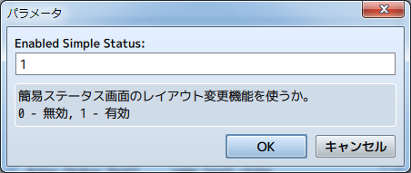

### スキル画面の有効設定
プラグインパラメータ`Enabled Skill Status`が 1 であることを確認してください。<br>
（デフォルトで設定済み）

この状態の時に、スキル画面の簡易ステータスの表示内容に対して、本プラグインの設定を反映します。

なお、拡張プラグインの[FTKR_CSS_SkillStatus.js](FTKR_CSS_SkillStatus.ja.md)と組み合わせることで、メニュー画面とスキル画面の表示内容を変えることが出来ます。

## 描画エリアサイズの設定

描画エリアのサイズは、プラグインパラメータ`Actor Status Width Rate`で設定します。３つの描画エリアの幅の**比率**を、カンマ(,)で区切って入力してください。

下の図の設定の場合は、表示エリアに対して描画エリア(1)~(3)を 2 : 2 : 3 の比率で分けます。
例えば表示エリアの幅が 350pixel だった場合、各描画エリアの幅は以下になります。(空白エリアのサイズが 0 だった場合)
* 描画エリア(1)の幅 - 100pixel
* 描画エリア(2)の幅 - 100pixel
* 描画エリア(3)の幅 - 150pixel


[目次に戻る](#目次)

## 描画エリアの設定
### 描画エリアの表示方法

プラグインパラメータ`Actor Status Text*`に設定した[コード](#表示できるステータス)の内容を、各[描画エリア](#描画エリア)に表示します。
* `Actor Status Text1` - 描画エリア(1)の内容
* `Actor Status Text2` - 描画エリア(2)の内容
* `Actor Status Text3` - 描画エリア(3)の内容


### ステータスの表示方式

プラグインパラメータに[コード](#表示できるステータス)を入力すると、描画エリア内にステータスを表示します。

描画エリア(2)の設定例
```
name,level
```
長いアクターの名前など描画エリアの幅よりもテキスト幅が長いステータスの場合でも、横に圧縮して描画エリア内に表示させます。


### カンマを使った入力
カンマ(,)で区切って入力したコードは、描画エリア内の次(下)の行に表示します。
複数のカンマで区切ることで縦に何行でも表示できますが、表示エリアを越えても表示できてしまうため、描画させるステータスの行数は表示エリアの高さ内に収めるようにしましょう。

描画エリア(3)の設定例
```
class,hp,mp
```


カンマ(,)を続けて2個入力すると、下の図のように1行空欄ができます。

描画エリア(2)の設定例
```
name,,level
```
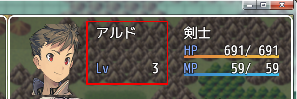

### 波括弧を使った入力
コードを波括弧( { } )で囲むと、そのステータスを右側の描画エリアも使用して表示します。

長い名前などをフォントサイズを変えずに表示させたい場合に使用できます。
ただし、右側の描画エリアと表示が重なるため、右側の描画エリアは 1行空けるように設定しましょう。

描画エリア(2)の設定例
```
{name},level
```
描画エリア(3)の設定例
```
,,class,hp,mp
```


### 角括弧を使った入力
複数のコードを角括弧('[' ']')で囲み、スラッシュ(/)で区切ると、描画エリア内の同じ行に横に並べて表示します。
角括弧内の片側を空欄にした場合は、描画エリアも片側が非表示になります。
```
class,[hp/mp],[tp/]
```
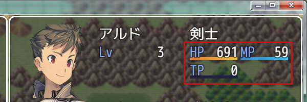

横に並べる際の表示間隔は、プラグインパラメータ`Actor Status Space In Text`の設定値(pixel単位)に従います。


[目次に戻る](#目次)

## 空白エリアの設定
空白エリアのサイズは、プラグインパラメータ`Actor Status Space`で設定します。４つの空白エリアの幅(pixel単位)を、カンマ(,)で区切って入力してください。

下の図の設定の場合は、各[空白エリア](#空白エリア)の幅は以下になります。
* 空白エリア(4)の幅 - 10pixel
* 空白エリア(5)の幅 - 20pixel
* 空白エリア(6)の幅 - 50pixel
* 空白エリア(7)の幅 - 10pixel


なお、描画エリアのサイズは、表示エリアの幅から空白エリアの全幅を引いた値を元に、プラグインパラメータ`Actor Status Width Rate`の比率で分けます。
空白エリアを取りすぎると、描画エリアが小さくなりすぎてしまうので注意してください。

[目次に戻る](#目次)

# ウィンドウの設定
メニュー画面のステータスウィンドウの行数やフォントサイズなど、ウィンドウ自体の設定を変更できます。

## プラグインパラメータの設定
以下のプラグインパラメータで設定できます。

### 設定の有効化
`Enabled Custom Window`

メニュー画面のステータスウィンドウ変更機能を使うか指定します。
* 0 - 無効(デフォルト)
* 1 - 有効

### 縦の行数
`Number Visible Rows`

ステータスウィンドウの縦の行数を変更します。
デフォルトは16行です。

### アクターを横に並べる数
`Number Max Cols`

ウィンドウ内でアクターを横に並べる数を変更します。
デフォルトは 1 です。

### カーソル高さの行数
`Cursol Line Number`

カーソルの高さ(アクター1人分の高さ)を何行分にするか設定します。
デフォルトは 4 です。

### 縦のカーソル間隔
`Cursol Height Space`

縦のカーソル間隔を設定します。
デフォルトは 0 です。(単位はpixel)

### フォントサイズ
`Font Size`

ウィンドウ内のフォントサイズを変更します。
デフォルトは 28 です。(単位はpixel)

### 余白サイズ
`Window Padding`

ウィンドウの周囲の余白を変更します。
デフォルトは 18 です。(単位はpixel)

### 行の高さ
`Window Line Height`

ウィンドウ内の1行の高さを変更します。
デフォルトは 36 です。(単位はpixel)

### 背景の透明度
`Window Opacity`

ウィンドウ内の背景の透明度を変更します。
デフォルトは 192 です。
0 - 透明、255 - 不透明

### ウィンドウ枠の非表示化
`Hide Window Frame`

ウィンドウ枠を非表示にするか指定します。
* 1 - 非表示にする
* 0 - 表示する(デフォルト)

[目次に戻る](#目次)

## ウィンドウ設定における補足

### ウィンドウの高さ
ウィンドウの高さは以下の計算で自動的に設定します。
```
[ウィンドウ高さ] ＝ [縦の行数] × [1行の高さ] + [余白のサイズ] × 2
```

### アクターを縦に並べる数
ウィンドウ内でアクターを縦に並べる数は、以下の計算で自動的に設定します。
```
[縦に並べる数] ＝ [縦の行数] ÷ [カーソル高さの行数]
```

### フォントサイズと行の高さ
基本的に、下の大小関係になるように設定しましょう。
```
フォントサイズ ＜ 1行の高さ
```

### ウィンドウを消す方法
以下の設定にすると、ウィンドウ枠とウィンドウの背景が消えて、アクターのステータスだけを表示します。

`Window Opacity`     : 0 <br>
`Hide Window Frame`  : 1

[目次に戻る](#目次)

# アクターの表示設定

デフォルトの設定では、メニュー画面でアクターを縦に4人まで並べて表示できます。
当プラグインの設定を変えることで、この表示人数やアクターの並べ方を変えることができます。

## アクターの縦の表示人数を変える場合

下の図のように、アクターの縦の表示人数を5人に変える場合の設定例を説明します。

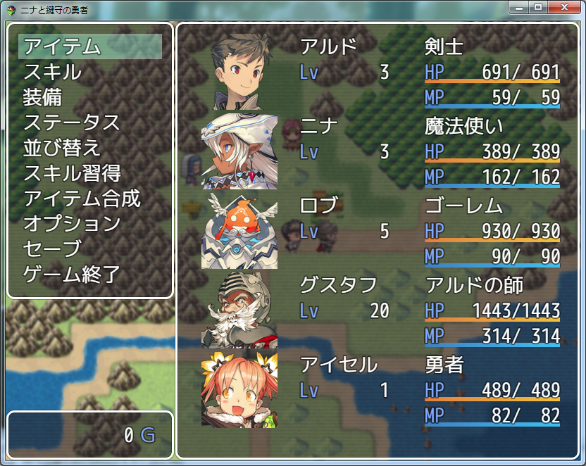

### ウィンドウの設定変更
縦5人に変える場合のウィンドウの設定箇所を説明します。

#### 設定の有効化をする
`Enabled Custom Window`の設定を 1 に変えてください。

#### カーソル高さを変更する
`Cursol Line Number`の設定を変更します。<br>
ウィンドウは16行(デフォルトの場合)あるため、アクター5人を並べる場合は 1人分は3行までになります。

### 縦のカーソル間隔を調整する
`Cursol Height Space`の設定を変更します。<br>
アクターの画像同士にスペースを空けたい場合は変更してください。
上記カーソル高さ変更により1行分(デフォルトの場合は36pixel)空欄が開くため、アクター5人を並べる場合は 8pixel まで間隔をあけることが出来ます。

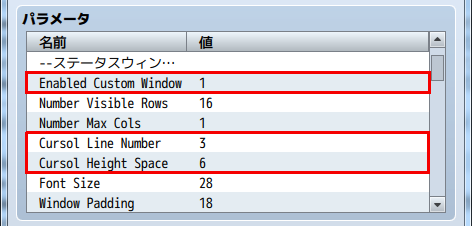

### レイアウトの設定変更
レイアウトの設定を行います。
ウィンドウ設定によりアクター1人分は 3行 までしか使用出来ません。
そのため、4行使用していた箇所を修正する必要があります。

#### 顔画像の設定変更
コード`face`は 4行分使用するため、3行に収めるためにはコード`face(3)`に変えてください。

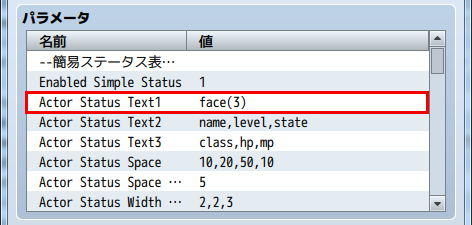

[目次に戻る](#目次)

## アクターを横に並べる場合

下の図のように、アクターを横に並べる場合の設定例を説明します。

なお、本プラグインは、コマンドウィンドウやステータスウィンドウの形状や位置を変えることは出来ません。
下の図では、各ウィンドウのレイアウト変更に公式プラグインの`AltMenuScreen.js`を使用しています。

レイアウト変更のプラグインと組み合わせる場合、以下の順番のように本プラグインを下にして登録してください。
```
AltMenuScreen.js
FTKR_CustomSimpleActorStatus.js
```

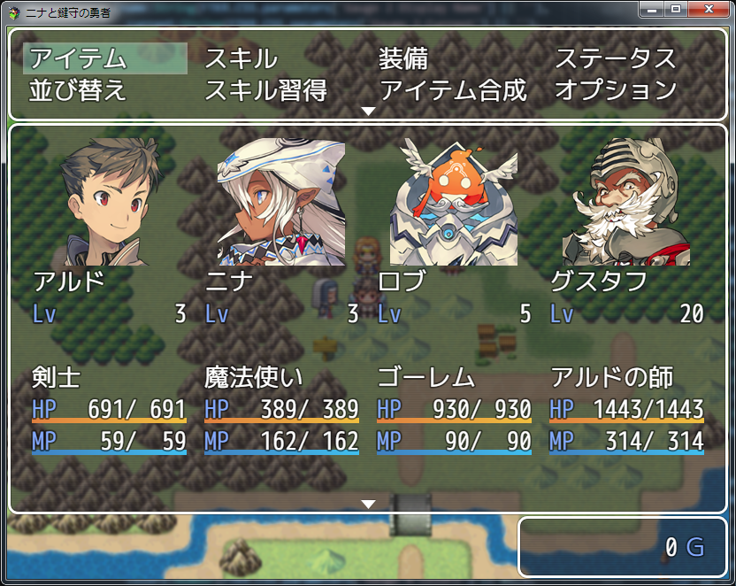

### ウィンドウの設定変更
横4人に変える場合のウィンドウの設定箇所を説明します。

#### 設定の有効化をする
`Enabled Custom Window`の設定を 1 に変えてください。

### 縦の行数を変更する
`Number Visible Rows`の設定を変更します。<br>
`AltMenuScreen.js`に合わせる場合、ウィンドウサイズは 11行 です。

### アクターを横に並べる数を変更する
`Number Max Cols`の設定を変更します。<br>
デフォルトの4人の場合は、4に設定してください。

#### カーソル高さを変更する
`Cursol Line Number`の設定を変更します。<br>
ウィンドウサイズに合わせて 11 に設定してください。


### レイアウトの設定変更
レイアウトの設定を行います。
アクターを横に並べることで、表示幅が狭くなっています。
そのため、描画エリアを1つにまとめると良いでしょう。

#### 描画エリアの設定変更

描画エリア2と3の設定を削除し、描画エリア1にまとめます。
描画エリア1の設定は、以下のとおりになります。

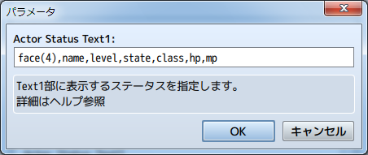

## 空白エリアの設定変更
`Actor Status Space`の設定を変更します。<br>
描画エリア2と3を削除するため、描画エリア1と2、描画エリア2と3の空白設定を 0 に変えます。
```
10,0,0,10
```

#### 描画エリアサイズの設定変更
`Actor Status Width Rate`の設定を変更します。<br>
描画エリア2と3を削除するため、描画エリア2と3の比率を 0 に変えます。
```
1,0,0
```

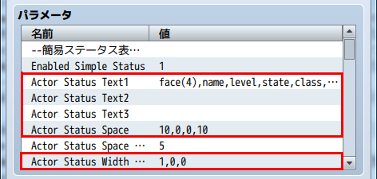

## 顔画像に別のステータスを重ねて表示
顔画像と重ねてステータスを表示する設定例を示します。
下の図のように、アクターを横に並べることで表示エリアが狭くなった場合などに使えます。

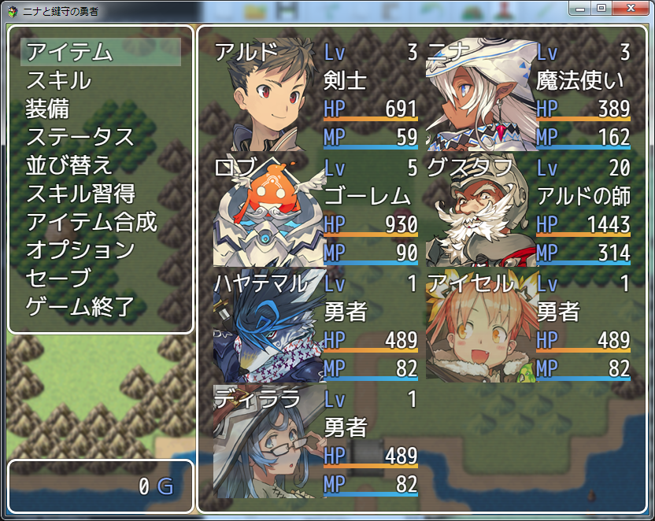

### レイアウトの設定

重ねて表示させるためのポイントは、以下の3点です。
* `Actor Status Width Rate`で描画エリア(1)の比率を 0 にする
* 描画エリア(1)の`face`に波括弧を使い描画エリアを拡張する
* `Face Position X`の設定を左寄せに変更する

この設定により、描画エリア(1)と描画エリア(2)を重ねて表示できます。

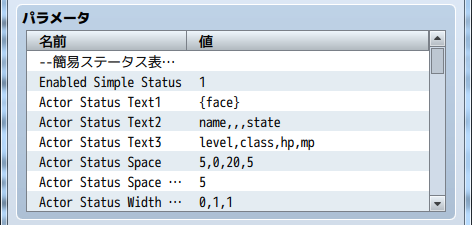

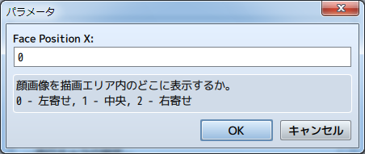

### ウィンドウの設定

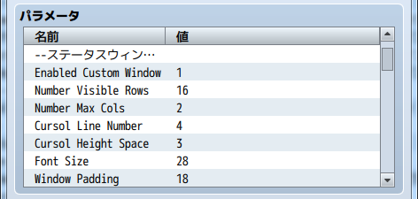

## 立ち絵を使った表示
立ち絵のような高さがある画像を使った場合の設定例を示します。


### レイアウトの設定

画像にステータスを重ねて表示させる方法を使います。
立ち絵は`image`で表示します。

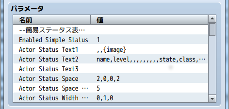

### ウィンドウの設定

ウィンドウの行数とカーソルの高さを合わせます。

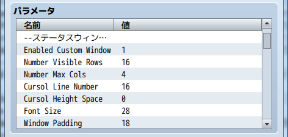

### アクターの設定

`image`で表示する画像をアクター毎に設定します。
デフォルトの画面サイズで横に４人並べる場合は、`BGI WIDTH`を 128 にすると、ちょうど良いサイズになります。
その他のパラメータは、画像内の立ち絵の位置や立ち絵の構造によって調整してください。

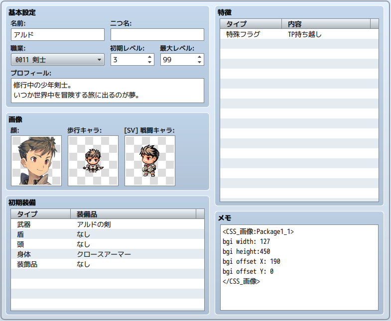

[目次に戻る](#目次)

# ステータスの表示

## 顔画像の表示

コード`face`または`face(x)`を入力した場合、アクターの顔画像を表示します。

コード`face`で表示する顔画像は、MVデフォルトでは 144*144 のサイズです。
1行は 36pixel に設定されているため、当倍サイズで表示するために必要な行数は 4 行です。

`face(x)`を使用すると、顔画像を圧縮拡大して x 行に収まるように画像を変形します。


下の画像は、`face(3)`で表示したものです。顔画像が3行に収まるので、その下にTPゲージなど、ステータスを追加できます。

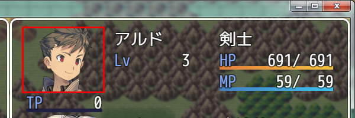

顔画像は、描画エリアの幅を超えて表示できません。
設定を 5 にした場合、描画に必要な幅は 180pixelになりますが、描画エリアの幅がこの値以下の場合は、描画エリアの幅までしか拡大できません。
プラグインパラメータ`Actor Status Width Rate`の設定も合わせて調整してください。

顔画像について、以下のパラメータで設定を変更できます。

`Face Position X`

アクターの顔画像を描画エリアのどの位置に表示するか設定します。
* 0 - 左寄せ
* 1 - 中央(デフォルト)
* 2 - 右寄せ

描画エリアの幅が、顔画像の表示幅よりも大きい場合に機能します。
また、波括弧を使って描画エリアを拡張した場合にも有効です。


[目次に戻る](#目次)

## 歩行キャラ画像の表示

コード`chara`を入力した場合、アクターのキャラクタ画像(歩行キャラ)を表示します。
キャラクタ画像について、以下のパラメータで設定を変更できます。

`Chara Image Width`<br>
`Chara Image Height`

アクターのキャラクタ画像のサイズを設定します。
標準では48*48の画像を使用していますが、それ以外のサイズの
キャラ画像を使用している場合に、設定値を変えてください。

`Chara Position X`

アクターのキャラクタ画像を描画エリアのどの位置に表示するか設定します。
* 0 - 左寄せ
* 1 - 中央(デフォルト)
* 2 - 右寄せ

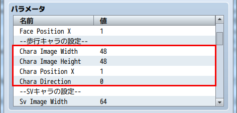

[目次に戻る](#目次)

## SV戦闘キャラ画像の表示
コード`sv`を入力した場合、アクターのSVキャラクタ画像(SV戦闘キャラ)を表示します。
SVキャラクタ画像について、以下のパラメータで設定を変更できます。

### 画像サイズの設定

`Sv Image Width`<br>
`Sv Image Height`

アクターのSVキャラクタ画像のサイズを設定します。
標準では64*64の画像を使用していますが、それ以外のサイズの
キャラ画像を使用している場合に、設定値を変えてください。

### 表示位置の設定

`Sv Position X`

アクターのSVキャラクタ画像を描画エリアのどの位置に表示するか設定します。
* 0 - 左寄せ
* 1 - 中央(デフォルト)
* 2 - 右寄せ

### 表示モーションの設定

`Sv Image Motion`

標準で表示するモーションを設定します。
表示するモーションの[コード名](Code_List.ja.md#モーション)を入力してください。

`Sv Motion Loop`

一部のループしないモーションに対して、表示モーションを
ループさせるか設定します。
* 0 - ループさせない
* 1 - ループさせる(デフォルト)

`Enabled State Motion`

ステートモーションを有効にするか設定します。
* 0 - 無効
* 1 - 有効(デフォルト)

有効にした場合、状態異常、戦闘不能、睡眠になっているキャラは、そのステートのモーションを表示します。

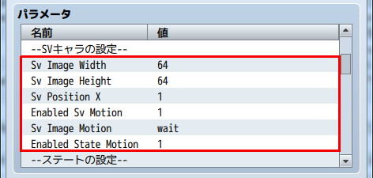

[目次に戻る](#目次)

## ステートアイコンの表示

コード`state`また`state2(x)`を入力した場合、アクターに付与されているステートのアイコンを表示することができます。
以下のプラグインパラメータで設定できます。

`Animation Wait`

ステートアイコンの切り替え時間を指定します。

`Enable Overlap`

ステートアイコンの重なり表示を有効にする。
* 0 - 無効(デフォルト)
* 1 - 有効
有効にすると、アイコンを重ねて表示させることで
一度に表示できるアイコン数を増やします。

`Overlap Rate`

ステートアイコンの重なり表示を有効にした場合に、
アイコンサイズの重なりの許容できる比率を指定します。
 0 ~ 1 の値を設定してください。

`Enable Auto Scale`

行の高さに合わせてアイコンサイズを縮小するか設定します。
* 0 - 無効(デフォルト)
* 1 - 有効

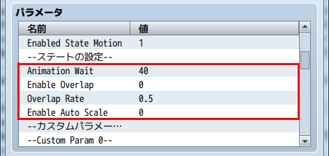

### アイコンを横に並べて表示

アイコンを横に並べて表示させる場合は、コード`state`を使用します。
`Enable Overlap`が有効で、ステートが複数付与されていて描画エリアの幅に収まらない場合は、図のように重ねて表示します。

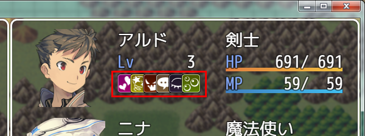

### アイコンを縦に並べて表示

アイコンを縦に並べて表示させる場合は、コード`state2(x)`を使用します。
x は何行を使って表示するか指定する値です。
`Enable Overlap`が有効で、ステートが複数付与されていて指定した行内に収まらない場合は、図のように重ねて表示します。

下の図の場合は、以下のコードを入力して4行に表示しています。
```
state2(4)
```
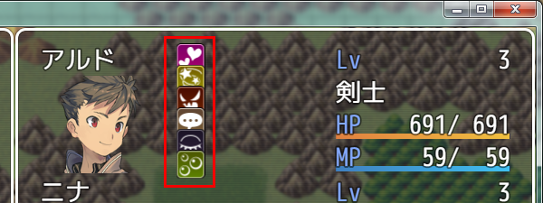

[目次に戻る](#目次)

## 装備パラメータの表示

コード`eparam(x)`を入力した場合、指定したアイテムを装備した時のパラメータを表示することができます。
`x`は 0 ~ 7 の値で、以下のどのパラメータを表示するか指定します。
* 0 - 最大HP
* 1 - 最大MP
* 2 - 攻撃力
* 3 - 防御力
* 4 - 魔法攻撃
* 5 - 魔法防御
* 6 - 敏捷性
* 7 - 運

デフォルトの装備画面と同様に右矢印`→`と合わせて、パラメータ値を表示します。

右矢印記号は、以下のプラグインパラメータで変更できます。

`Equip Right Arrow`

装備を変える時に表示する右矢印記号を指定します。
制御文字が使用できます。


[目次に戻る](#目次)

## カスタムパラメータの表示

コード`custom(x)`を入力した場合、プラグインパラメータ`Custom Param x`で設定したパラメータを表示することができます。
カスタムパラメータは、最大で20種類設定できます。

### パラメータの設定

`Custom x Display Name`

パラメータの表示名を設定します。
表示名には制御文字が使用できます。

`Custom x References`

パラメータの値の参照先を 計算式(eval) で設定します。

### 計算式(eval) の値について

計算式(eval)は、ダメージ計算式のように、計算式を入力することで、固定値以外の値を使用することができます。以下のコードを使用できます。
* a.param - アクターのパラメータを参照します。(a.hit でアクターの命中率)
* v[x]    - 変数ID x の値を参照します。
* s[x]    - スイッチID x の値を参照します。

命中率のような百分率の値の場合、`a.hit`とそのまま記述すると少数で表示します。
そのため、以下のように記述して整数に変換するようにします。
```
a.hit * 100
a.hit.parcent()
```

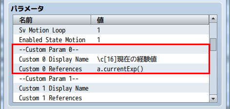

[目次に戻る](#目次)

## カスタムゲージの表示
コード`gauge(x)`を入力した場合、`Gauge Param x`で設定したゲージを表示することができます。
カスタムゲージは、最大で10種類設定できます。

### 共通設定
`Gauge Param Digit`

現在値と最大値の表示幅を指定した桁数に設定します。
この桁数以上の値の場合、横に圧縮して表示します。

### 個別パラメータの設定
`Gauge x Display Name`

ゲージの表示名を設定します。
表示名には制御文字が使用できます。
表示名を設定しない場合、ゲージの現在値と最大値の数値を表示しません。

`Gauge x References`

ゲージで表示する値の参照先をeval値で設定します。
この値を設定すると、現在値と最大値は表示しません。

`Gauge x Current`

ゲージの現在値の参照先を 計算式(eval) で設定します。

`Gauge x Max`

ゲージの最大値の参照先を 計算式(eval) で設定します。
最大値の数値は、描画エリアの幅が足りない場合には表示しません。

`Gauge x Color1`<br>
`Gauge x Color2`

ゲージの色1と色2を設定します。
色1と色2の値を変えることで、HPゲージのようにグラデーションに表示します。
-1 を指定すると、ゲージバーを非表示にします。

### 計算式(eval) の値について

計算式(eval)は、ダメージ計算式のように、計算式を入力することで、固定値以外の値を使用することができます。以下のコードを使用できます。
* a.param - アクターのパラメータを参照します。(a.hit でアクターの命中率)
* v[x]    - 変数ID x の値を参照します。
* s[x]    - スイッチID x の値を参照します。

命中率のような百分率の値の場合、`a.hit`とそのまま記述すると少数で表示します。
そのため、以下のように記述して整数に変換するようにします。
```
a.hit * 100
a.hit.parcent()
```

プラグインには、デフォルトで ゲージ0 に現在EXPと次レベルのEXPからなる経験値ゲージを設定しています。
カスタムゲージを作る上での参考にしてください。

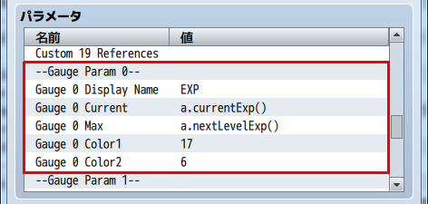

[目次に戻る](#目次)

## カスタム画像の表示
コード`image`を入力した場合、アクターのメモ欄で設定した画像を表示する
ことができます。


### メモ欄の設定
設定には以下のタグを入力します。
```
<CSS_画像:画像名>
code
</CSS_画像>
```
または
```
<CSS_IMAGE:imagename>
code
</CSS_IMAGE>
```
表示させたい画像名を入力します。<br>
画像は、プロジェクトフォルダ内の/img/picture/に保存してください。

### code に使用できるタグ

以下のタグで、画像を四角に切り取って表示することができます。
設定しない場合は、画像をそのまま表示します。

`Bgi offset X: n`

画像ファイルを四角に切り取る時の左上のX座標 n を入力します。

`Bgi offset Y: n`

画像ファイルを四角に切り取る時の左上のY座標 n を入力します。

`Bgi width: n`

画像ファイルを四角に切り取る時の幅 n を入力します。

`Bgi height: n`

画像ファイルを四角に切り取る時の高さ n を入力します。

[目次に戻る](#目次)

## アクター別のカスタムゲージの表示
コード`agauge(x)`を入力した場合、アクターのメモ欄で設定したゲージを表示することができます。
メモ欄で設定していないアクターは、空欄になります。

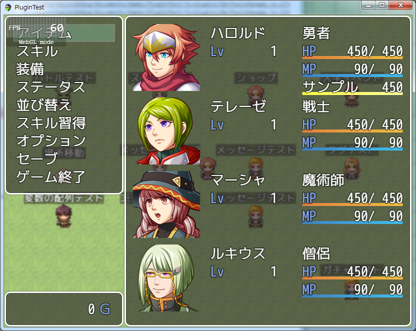

### メモ欄の設定
設定には以下のタグを入力します。
```
<CSS_カスタム: x>
code
</CSS_カスタム>
```
または
```
<CSS_CUSTOM: x>
code
</CSS_CUSTOM>
```
コード`agauge(x)`で表示するゲージを設定します。
現在値と最大値の表示桁数はカスタムゲージの設定を使用します。

### code に使用できるタグ
```
表示名: y
NAME: y
```
ゲージの表示名を設定します。
表示名には制御文字が使用できます。
表示名を設定しない場合、ゲージの現在値と最大値の数値を表示しません。

```
参照先: eval
REFERENCES: eval
```
ゲージで表示する値の参照先をeval値で設定します。
この値を設定すると、現在値と最大値は表示しません。

```
現在値: eval
CURRENT: eval
```
ゲージの現在値の参照先を 計算式(eval) で設定します。

```
最大値: eval
MAX: eval
```
ゲージの最大値の参照先を 計算式(eval) で設定します。
最大値の数値は、描画エリアの幅が足りない場合には表示しません。

```
色: y1,y2
COLOR: y1,y2
```
ゲージの色1を y1 に、色2を y2 に設定します。
色1と色2の値を変えることで、HPゲージのようにグラデーションに表示します。
-1 を指定すると、ゲージバーを非表示にします。

### 計算式(eval) の値について

計算式(eval)は、ダメージ計算式のように、計算式を入力することで、固定値以外の値を使用することができます。以下のコードを使用できます。
* a.param - アクターのパラメータを参照します。(a.hit でアクターの命中率)
* v[x]    - 変数ID x の値を参照します。
* s[x]    - スイッチID x の値を参照します。

命中率のような百分率の値の場合、`a.hit`とそのまま記述すると少数で表示します。
そのため、以下のように記述して整数に変換するようにします。
```
a.hit * 100
a.hit.parcent()
```

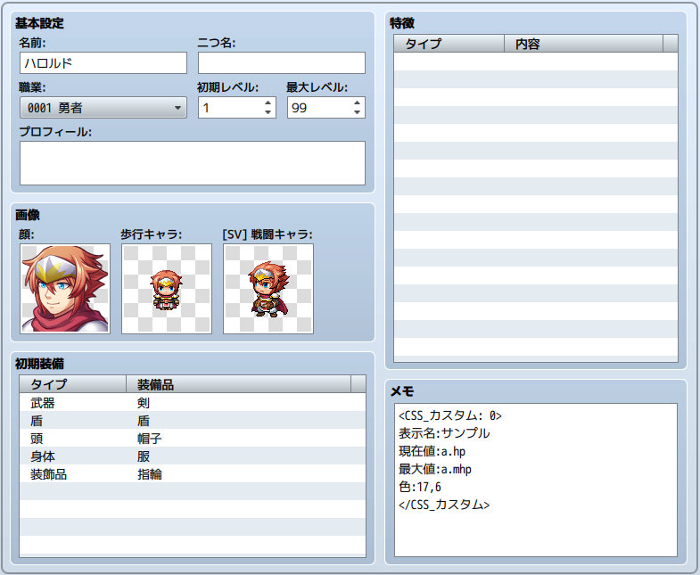

[目次に戻る](#目次)

## クラス別のカスタムゲージの表示
コード`cgauge(x)`を入力した場合、クラスのメモ欄で設定したゲージを表示することができます。
メモ欄で設定していないクラスは、空欄になります。

### メモ欄の設定
アクター別のカスタムゲージど同じです。

### code に使用できるタグ
アクター別のカスタムゲージど同じです。

### 計算式(eval) の値について
アクター別のカスタムゲージど同じです。

[目次に戻る](#目次)

## プラグインの更新履歴

| バージョン | 公開日 | 更新内容 |
| --- | --- | --- |
| [ver1.7.0](FTKR_CustomSimpleActorStatus.js) | 2017/06/02 | アクター毎に個別に設定できるカスタムゲージを追加<br>クラス毎に個別に設定できるカスタムゲージを追加<br>プラグインパラメータEnabled Skill Statusを無効にした場合にスキル画面のステータス欄が表示しない不具合を修正 |
| ver1.6.0 | 2017/06/01 | カスタムゲージの表示内容の調整機能を見直し<br>カスタムゲージのゲージバーを非表示にする機能を追加<br>カスタムゲージに現在値と最大値の替わりに指定した値を設定する機能を追加 |
| ver1.5.3 | 2017/05/13 | 装備画面で使用可能なパラメータ表示コード'eparam'を追加 |
| ver1.5.2 | 2017/05/12 | アクターを横に並べたときに描画エリアを拡張すると、隣のアクターの表示エリアにも拡張される不具合を修正<br>画像の表示位置の調整機能を追加 |
| ver1.5.1 | 2017/05/11 | ステータスウィンドウに表示できる人数よりもパーティーが少ない場合にエラーになる不具合を修正 |
| ver1.5.0 | 2017/05/10 | FTKR_FacialImageDifference.jsに対応 |
| [ver1.4.4](/archive/FTKR_CustomSimpleActorStatus_1.4.4.js) | 2017/05/08 | メニュー画面のアクターのスプライトが正しく更新されない不具合を修正 |
| ver1.4.3 | 2017/05/06 | アクターを横に並べた時に、顔画像が正しく表示されない不具合を修正<br>縦のカーソル間隔を設定する機能を追加 |
| ver1.4.2 | 2017/05/04 | カスタムパラメータとカスタムゲージにアクターのセルフ変数を適用 |
| ver1.4.1 | 2017/04/25 | 逃走で戦闘終了するとSVキャラの表示位置が移動する不具合を修正 |
| ver1.4.0 | 2017/04/21 | メニュー画面以外の表示変更機能を拡張プラグインとして分離<br>顔画像の表示仕様を変更<br>カスタム画像のタグの仕様を変更<br>メニュー画面の簡易ステータスウィンドウの設定変更機能を追加 |
| [ver1.3.1](/archive/FTKR_CustomSimpleActorStatus_1.3.1.js) | 2017/04/21 | FTKR_ExSvMotion.jsに対応 |
| ver1.3.0 | 2017/04/19 | ステートアイコンの表示仕様を変更 |
| [ver1.2.5](/archive/FTKR_CustomSimpleActorStatus_1.2.5.js) | 2017/04/15 | ステートアイコンの表示位置を微調整 <br> 行の高さに合わせてステートアイコンのサイズを調整する機能を追加 |
| ver1.2.4 | 2017/04/12 | 顔画像の拡大縮小処理修正 |
| ver1.2.3 | 2017/04/11 | ヘルプ修正 |
| ver1.2.2 | 2017/04/11 | 機能追加、GitHubで公開開始 |
| ver1.2.1 | 2017/04/01 | 機能削除、機能追加、[ツクマテ](http://tm.lucky-duet.com/viewtopic.php?f=5&t=3305)で公開 |
| ver1.0.0 | 2017/03/09 | 初版作成、[ツクマテ](http://tm.lucky-duet.com/viewtopic.php?f=5&t=3305)で公開 |

## 拡張プラグイン

以下のプラグインを使用することで、本プラグインの機能を拡張できます。

* [FTKR_CSS_BattleStatus](FTKR_CSS_BattleStatus.ja.md) - バトル画面のステータスレイアウトを変更できます
* [FTKR_CSS_DetailedStatus](FTKR_CSS_DetailedStatus.ja.md) - ステータス画面のステータスレイアウトを変更できます
* [FTKR_CSS_SkillStatus](FTKR_CSS_SkillStatus.ja.md) - スキル画面のステータスレイアウトを変更できます
* [FTKR_AddOriginalParameters](FTKR_AddOriginalParameters.ja.md) - カスタムパラメータやカスタムゲージに使用可能なアクターのオリジナルパラメータを作成できます
* [FTKR_ExSvMotion.js](FTKR_ExSvMotion.ja.md) - ステート付加時のモーションを追加・変更できます。
* [FTKR_ItemSelfVariables.js](FTKR_ItemSelfVariables.ja.md) - カスタムパラメータやカスタムゲージに使用可能なアクターのセルフ変数を追加できます。
* [FTKR_FTKR_FacialImageDifference.js](FTKR_FTKR_FacialImageDifference.ja.md) - 表示する顔画像をアクターの状態で変更できます。

## ライセンス

本プラグインはMITライセンスのもとで公開しています。

[The MIT License (MIT)](https://opensource.org/licenses/mit-license.php)

#
[目次に戻る](#目次)

[トップページに戻る](README.md)