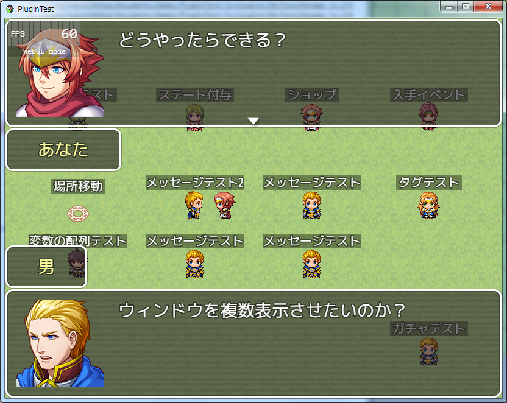

[トップページに戻る](README.md)

# [FTKR_ExMessageWindow2](FTKR_ExMessageWindow2.js) プラグイン

一度に複数のメッセージウィンドウを表示するプラグインです。
本プラグインは、FTKR_ExMessageWindow.jsと組み合わせて使用できません。

ダウンロード: [FTKR_ExMessageWindow2.js](https://raw.githubusercontent.com/futokoro/RPGMaker/master/FTKR_ExMessageWindow2.js)

## 目次

以下の項目の順でプラグインの使い方を説明します。
1. [概要](#概要)
1. [プラグインの登録](#プラグインの登録)
2. [基本仕様](#基本仕様)
    1. [拡張メッセージウィンドウ](#拡張メッセージウィンドウ)
    1. [メッセージウィンドウID](#メッセージウィンドウID)
    1. [シーンが変わったときの挙動](#シーンが変わったときの挙動)
3. [拡張メッセージウィンドウを使用した文章の表示](#拡張メッセージウィンドウを使用した文章の表示)
    1. [基本の表示方法](#基本の表示方法)
    1. [複数ウィンドウの表示方法](#複数ウィンドウの表示方法)
4. [文章表示中にプレイヤーの行動を許可する](#文章表示中にプレイヤーの行動を許可する)
    1. [基本的な使い方](#基本的な使い方)
    1. [文章表示中のイベントに話しかけたい場合](#文章表示中のイベントに話しかけたい場合)
7. [スクリプトコマンド](#スクリプトコマンド)
8. [プラグインコマンド](#プラグインコマンド)
* [プラグインの更新履歴](#プラグインの更新履歴)
* [類似プラグイン](#類似プラグイン)
* [ライセンス](#ライセンス)

## 概要

このプラグインを使用することで、文章の表示イベントで以下の動作が可能になります。

1. 複数のメッセージウィンドウを画面に表示できます。
2. メッセージ表示中にプレイヤーの行動を許可できます。<br>(イベント実行のトリガーが「自動実行」または「並列処理」の場合のみ)
3. 表示中のメッセージウィンドウを強制終了させることができます。



[目次に戻る](#目次)

## プラグインの登録

以下のプラグインと組み合わせて使用する場合は、プラグイン管理画面で、以下の順の配置になるように登録してください。
```
YEP_MessageCore.js
FTKR_ExMessageWindow2.js
MessageWindowPopup.js
```

`YEP_MessageCore.js`<br>
メッセージウィンドウの機能を向上させるYanfly氏製のプラグイン。<br>
使用できる制御文字が大幅に増えるだけでなく、名前を別ウィンドウに表示できるようになります。

`MessageWindowPopup.js`<br>
メッセージウィンドウをフキダシとして使用できるトリアコンタン氏製のプラグイン。<br>
本プラグインと組み合わせることで、複数のフキダシを表示できるようになります。

[目次に戻る](#目次)

## 基本仕様

### 拡張メッセージウィンドウ

本プラグインを有効にすると、イベントコマンド「文章の表示」に使用するウィンドウに、MVデフォルトのメッセージウィンドウとは別のメッセージウィンドウを使用します。

これを、本プラグインでは拡張メッセージウィンドウと呼びます。

### メッセージウィンドウID

拡張メッセージウィンドウは、それぞれ個別のメッセージウィンドウID(ウィンドウID)を持っています。
このIDを変えることで、一度に複数のウィンドウを表示させることができます。

メッセージウィンドウIDは、プラグインのデフォルトで ID0 を使用します。

#### 拡張メッセージウィンドウの数
ウィンドウIDを何番まで使用できるかは以下の設定によります。

1. プラグインパラメータ`<Create ExWindow Number>`の設定
2. 各マップのメモ欄のタグ`<EMW_生成数: x>`または`<EMW_NUMBER: x>`の x値

設定値が 2 なら、ID0 ~ ID2 まで使用できます。
なお、マップのメモ欄の設定を優先します。

#### ウィンドウの表示順について
複数のウィンドウIDの表示が重なった場合、ウィンドウIDが大きい方を前に表示します。
ただし、ID0については常に最前面になります。

#### ！！注意！！
ウィンドウデータは、シーン開始時に生成します。
ウィンドウIDの生成数が多すぎる場合(*1)、シーン変更に数秒掛かるようになる可能性があります。

(*1) PCのスペックや、マップの広さ、マップ上のイベント数などによって変わります。

### シーンが変わったときの挙動

メッセージ表示中にプレイヤーの行動を許可した場合、メッセージ表示中にシーンが変わる可能性があります。シーンが変わったときの各ウィンドウの挙動は、以下の通りです。

#### 場所移動
場所移動時に、すべてのウィンドウIDを強制終了します。

#### バトル
バトル開始時に、すべてのウィンドウIDを強制終了します。

#### メニュー
すべてのウィンドウIDが一旦閉じます。
メニューを閉じた後の処理は、プラグインパラメータ`<Scene Start Terminate>`の設定で変わります。
* 0 - 無効 : 再度ウィンドウが開きます。
* 1 - 有効 : すべてのウィンドウIDを強制終了します。(デフォルト)

#### ！！注意！！
別の並列処理イベントで文章を繰り返し表示している場合、シーン変更のタイミングによっては強制終了とシーン変更処理の間に文章表示コマンドを実行してしまう場合があります。
この場合、シーン変更後にその文書を表示してしまいます。

これを回避するためには、以下のような方法があります。
* １. プラグインパラメータの`<Scene Start Terminate>`の設定を有効にする。
* ２. シーン変更の直前に、並列処理イベントの動作を止めるようにイベントを組む。

[目次に戻る](#目次)

## 拡張メッセージウィンドウを使用した文章の表示

### 基本の表示方法
以下にイベント例を示します。

```
◆プラグインコマンド：EMW_メッセージウィンドウ指定 1
◆文章：なし, ウィンドウ, 下
：　　：これがメッセージウィンドウIDを指定する方法だ
```

プラグインコマンド「EMW_メッセージウィンドウ指定 x」を使うことで
表示させるウィンドウIDを指定します。
このように、文章イベントの実行前にプラグインコマンドで設定します。

ウィンドウIDを変えない場合は、下のように文章イベントを続けることができます。
```
◆プラグインコマンド：EMW_メッセージウィンドウ指定 1
◆文章：なし, ウィンドウ, 下
：　　：これがメッセージウィンドウIDを指定する方法だ
◆文章：なし, ウィンドウ, 下
：　　：この文章もメッセージウィンドウID1に表示するぞ
```

なお、プラグインパラメータ`<Reset Window Id>`の設定を有効にすると、イベント終了時にウィンドウIDをリセットして、ID0に変更します。

### 複数ウィンドウの表示方法

メッセージウィンドウIDを使うことで、複数のウィンドウを表示させることができます。

#### ウィンドウを閉じさせない方法
通常、メッセージウィンドウは表示が終わりキー入力後にウィンドウが閉じます。
拡張メッセージウィンドウも基本的には変わりません。

本プラグインでは、以下のプラグインコマンドを使用すると、ウィンドウを閉じなくすることができます。

```
◆プラグインコマンド：EMW_メッセージウィンドウ指定 1 終了禁止
◆文章：なし, ウィンドウ, 下
：　　：こうするとメッセージウィンドウID1は閉じないぞ
```

ただし、このままではイベントが終わってもウィンドウが表示したままになります。
そのため、以下のいずれかの方法でウィンドウを閉じる必要があります。

#### 強制終了コマンドで閉じる
プラグインコマンド「EMW_メッセージウィンドウ強制終了 x」を使うことでウィンドウID x を閉じます。
```
◆プラグインコマンド：EMW_メッセージウィンドウ指定 1 終了禁止
◆文章：なし, ウィンドウ, 下
：　　：こうするとメッセージウィンドウID1は閉じるぞ
◆プラグインコマンド：EMW_メッセージウィンドウ強制終了 1
```

#### 終了許可設定にした新たに文章表示イベントを実行する
プラグインコマンド「EMW_メッセージウィンドウ設定 x 終了許可」を使うことでウィンドウID x が閉じるようになります。

```
◆プラグインコマンド：EMW_メッセージウィンドウ指定 1 終了禁止
◆文章：なし, ウィンドウ, 下
：　　：こうするとメッセージウィンドウID1は閉じないぞ
◆プラグインコマンド：EMW_メッセージウィンドウ指定 1 終了許可
◆文章：なし, ウィンドウ, 下
：　　：こうするとメッセージウィンドウID1は閉じるぞ
```
この場合、一つ目の文章ではウィンドウは閉じませんが、二つめの文章イベントでは、キー入力後にウィンドウが閉じます。
必ず、終了許可後に文章イベントを実行してください。

### 複数ウィンドウを表示するイベントの組み方

「複数のウィンドウIDの指定」と「ウィンドウを閉じさせない方法」を使うことで、複数のウィンドウを画面に表示することができます。

以下は画面の上下で会話するイベント例です。
```
◆プラグインコマンド：EMW_メッセージウィンドウ指定 1 終了禁止
◆文章：なし, ウィンドウ, 下
：　　：こうするとメッセージウィンドウID1は閉じないぞ
◆プラグインコマンド：EMW_メッセージウィンドウ指定 2 終了禁止
◆文章：なし, ウィンドウ, 上
：　　：確かにメッセージウィンドウID2も閉じないな
◆プラグインコマンド：EMW_メッセージウィンドウ指定 1
◆文章：なし, ウィンドウ, 下
：　　：これはいいな
◆プラグインコマンド：EMW_メッセージウィンドウ指定 2
◆文章：なし, ウィンドウ, 上
：　　：そうだな
◆プラグインコマンド：EMW_メッセージウィンドウ強制終了 すべて
```

下に表示するウィンドウをウィンドウID1に、上に表示するウィンドウをウィンドウID2 に設定します。
また、両方のウィンドウIDを終了禁止にします。

こうすることで、以降の文章イベントでウィンドウが表示したまま表示内容が更新できます。

そして、最後のコマンドによって表示しているウィンドウID1とID2を閉じます。

このような流れで、メッセージウィンドウを複数表示することができます。
あとは、3番目の文章と4番目の文章のように、ウィンドウ指定コマンドと文章を
追加していくことで、長い会話イベントを作成することができます。

[目次に戻る](#目次)

## 文章表示中にプレイヤーの行動を許可する

本プラグインでは、メッセージ表示中のプレイヤーの行動を許可できます。
(イベント実行のトリガーが「自動実行」または「並列処理」の場合のみ)
行動を許可するためには、以下の方法があります。

#### プラグインコマンドで設定する
以下のプラグインコマンドでウィンドウID表示中の行動を許可できます。
```
EMW_メッセージウィンドウ行動許可 ウィンドウID
EMW_MESSAGEWINDOW_CANMOVE windowID
```
または
```
EMW_メッセージウィンドウ指定 ウィンドウID 行動許可
EMW_MESSAGEWINDOW_SET windowID CANMOVE
```

#### スクリプトで設定する
以下のスクリプトでウィンドウID表示中の行動を許可できます。
```
$gameMessageEx.window(ウィンドウID).enabledCanMovePlayer()
```

#### 文章中に制御文字を入力
以下の制御文字を文章中に入力することで、メッセージ表示中のプレイヤーの行動可否を設定できます。
```
\EMP - 行動を許可
\DMP - 行動を禁止
```

なお、複数のウィンドウを表示している場合は、すべてのウィンドウIDに対して行動許可を設定しなければいけません。

#### ！！注意１！！
行動許可の設定は、イベントのトリガーが「自動実行」または「並列処理」の場合に有効になります。
「決定ボタン」や「○○から接触」によって実行するイベントの場合、行動許可は無効になります。

#### ！！注意２！！
行動許可の設定はすべてのシーンで共通です。
そのため、行動許可設定にした場合、場所移動等を行っても対象のウィンドウIDは行動許可設定のままです。
行動禁止設定にしたい場合は、かならず行動禁止コマンドや制御文字を実行してください。
(強制終了コマンドでは行動禁止設定にはなりません)

### 基本的な使い方

イベントの文章表示中にプレイヤーの行動を許可した場合、別のイベントと会話イベントを起こすことが可能です。

この場合、文章表示中のメッセージウィンドウIDとは別のウィンドウIDに表示させる必要があります。

文章表示のイベントコマンドの前に、ウィンドウIDを指定するコマンドを実行してください。

なお、複数のメッセージウィンドウを表示している間に行動を許可させる場合は、表示しているすべてのウィンドウIDに対して行動許可が必要です。

### 文章表示中のイベントに話しかけたい場合

文章を表示しているイベントに話しかけたい場合は、以下のイベントの作成方法が
あります。

#### 自動で表示させる文章表示イベントの作成
「自律移動」のタイプ「カスタム」のルート設定内に、以下のスクリプトを入力することで文章を表示させます。

スクリプト
```
$gameMessageEx.window(1).add('\\EMP文章\\|\\^')
```

window(1) は 文章を表示させるウィンドウID の番号を指定します。
ここでは、例としてID1 を使用します。

add()内には、表示する文章を入力します。
使用している制御文字の意味は以下の通りです。
* `\\EMP` - プレイヤーの行動を許可
* `\\|`   - ウィンドウを1秒表示
* `\\^`   - プレイヤーの入力待ちを不要

#### 話しかけて表示させる文章表示イベントの作成
上記と同じページの実行内容に以下のイベントを作成します。
トリガーは「決定ボタン」です。

実行内容
```
◆プラグインコマンド：EMW_メッセージウィンドウ強制終了 1
◆プラグインコマンド：EMW_メッセージウィンドウ指定 2
◆文章：なし, ウィンドウ, 下
：　　：話しかけるな！
```

1行目のコマンドで、自動表示しているウィンドウを消します。
この時に指定する番号は、スクリプト内で使用したウィンドウIDと合わせてください。

2行目に別のウィンドウIDを指定して、3行目で文章を表示します。
会話で表示するウィンドウIDを別にする理由は、強制終了の処理が終わる前に文章表示コマンドの読み込みが始まり、同じIDだと閉じて表示できないためです。

[目次に戻る](#目次)

## スクリプトコマンド

拡張メッセージウィンドウのゲームデータは以下のスクリプトで参照できます。
```
$gameMessageEx.window(ウィンドウID)
```

拡張メッセージウィンドウのゲームデータに使用できる関数や変数はMVデフォルトのメッセージウィンドウ($gameMessage)と同じです。

以下に、スクリプトの一例を示します。

### 文章を表示
```
$gameMessageEx.window(ウィンドウID).disp('文章')
```
ウィンドウIDの表示設定を初期化した後に'文章'を表示します。
'文章'には制御文字が使用できますが、`\\v[1]`の様に`\`記号を2つ使う必要があるので注意です。
文章中に`\n`を記入すると、その部分で改行します。(`\`は一つです)

### 文章を追加
```
$gameMessageEx.window(ウィンドウID).add('文章')
```
ウィンドウIDに'文章'を追加します。
上記の表示用スクリプトに連続して使用することで、表示する文章を追加できます。
追加した文章は改行後に表示します。

### 顔画像の設定
```
$gameMessageEx.window(ウィンドウID).setFaceImage('顔画像名', 顔番号)
```
* 顔画像名 - 表示する顔画像のファイル名です。(例:'Actor1')
* 顔番号　 - ファイル内の何番目の顔かを指定する番号です。左上が 0番です。

### 背景の設定
```
$gameMessageEx.window(ウィンドウID).setBackground(背景番号)
```
* 背景番号 - 表示したい背景タイプの番号を指定してください。
    * 0 - ウィンドウ
    * 1 - 暗くする
    * 2 - 透明

### 表示位置の設定
#### Y座標
```
$gameMessageEx.window(ウィンドウID).setPositionType(位置番号)
```
* 位置番号 - 表示したい位置の番号を指定してください。
    * 0 - 上
    * 1 - 中
    * 2 - 下

#### X座標
```
$gameMessageEx.window(ウィンドウID).setPositionX(位置番号)
```
* 位置番号 - 表示したい位置の番号を指定してください。
    * 0 - 左
    * 1 - 中
    * 2 - 右

### ウィンドウサイズの設定
```
$gameMessageEx.window(ウィンドウID).setWindowSize(幅, 行数)
```
* 幅 - 横幅をpixel単位で数値指定してください。
* 行数 - 高さを行数単位で数値指定してください。

それぞれ、0 を指定するとデフォルトサイズを使用します。

### 表示内容の初期化
```
$gameMessageEx.window(ウィンドウID).clear()
```
表示する文章や顔画像等の設定内容を初期化します。
なお、一度ウィンドウを閉じると自動的に初期化します。

### ウィンドウの終了禁止
```
$gameMessageEx.window(ウィンドウID).prohibitClose()
```
指定したウィンドウIDを終了禁止設定にします。

### ウィンドウの終了許可
```
$gameMessageEx.window(ウィンドウID).permitClose()
```
指定したウィンドウIDを終了許可設定にします。

### ウィンドウの強制終了
```
$gameMessageEx.window(ウィンドウID).terminate()
```
指定したウィンドウIDを強制終了します。

### ウィンドウ表示中の行動許可
```
$gameMessageEx.window(ウィンドウID).enabledCanMovePlayer()
```
指定したウィンドウIDの表示中のプレイヤーの行動を許可します。

### ウィンドウ表示中の行動禁止
```
$gameMessageEx.window(ウィンドウID).disabledCanMovePlayer()
```
指定したウィンドウIDの表示中のプレイヤーの行動を禁止します。

[目次に戻る](#目次)

## プラグインコマンド

### 文章の表示の強制終了
```
EMW_メッセージウィンドウ強制終了 すべて
EMW_MESSAGEWINDOW_CLOSE ALL
EMW_メッセージウィンドウ強制終了 Id
EMW_MESSAGEWINDOW_CLOSE Id
```
表示されているメッセージウィンドウを強制的に閉じます。
* すべて - 表示しているすべてのウィンドウIDを強制的に閉じます。
* Id　　 - 指定したウィンドウのIDを強制的に閉じます。指定しない場合は、ウィンドウID0 を閉じます。

### 文章を表示するウィンドウを指定
```
EMW_メッセージウィンドウ指定 Id (終了禁止/終了許可) (行動許可/行動禁止) (幅 x) (行数 y) (左/中/右)
EMW_MESSAGEWINDOW_SET Id (NOEND/CANCLOSE) (CANMOVE/NOTMOVE) (WIDTH x) (LINES y) (LEFT/CENTER/RIGTH)
```
このコマンド以降に文章を表示する場合に使用する拡張ウィンドウのメッセージウィンドウIDを指定します。
また、引数に以下のパラメータをつける事で、ウィンドウの設定も合わせて行うことが出来ます。(順不同)
* '終了禁止' - ウィンドウを終了禁止にする。
* '終了許可' - ウィンドウが閉じることを許可する。
* '行動許可' - ウィンドウ表示中の行動を許可する。
* '行動禁止' - ウィンドウ表示中の行動を禁止する。
* '幅 x' - ウィンドウの幅を x pixelに設定する。
* '行数 y' - ウィンドウの高さを y 行分に設定する。
* '左' - ウィンドウを画面左寄せで表示する。
* '中' - ウィンドウを画面中央に表示する。
* '右' - ウィンドウを画面右寄せで表示する。

例)
```
EMW_メッセージウィンドウ指定 1
EMW_メッセージウィンドウ指定 2 終了禁止 行動許可 幅 500 行数 2 中
```

### 文章を表示するウィンドウの指定をリセット
```
EMW_メッセージウィンドウリセット
EMW_MESSAGEWINDOW_RESET
```
このコマンド以降に文章を表示する場合に使用する拡張ウィンドウのメッセージウィンドウIDをリセットします。(ID0 になる)

### メッセージウィンドウの終了禁止(ウィンドウが閉じない)
```
EMW_メッセージウィンドウ終了禁止 Id
EMW_MESSAGEWINDOW_NOEND Id
```
指定したIDのウィンドウはメッセージ表示後に閉じなくなります。
禁止設定にしたウィンドウを閉じるためには以下の動作が必要です。
* a. 強制終了コマンドで閉じる
* b. 終了許可設定にした上で、新たにメッセージを表示させる。

### メッセージウィンドウの終了許可(ウィンドウが閉じる)
```
EMW_メッセージウィンドウ終了許可 Id
EMW_MESSAGEWINDOW_CANCLOSE Id
```
指定したIDのウィンドウはメッセージ表示後に閉じるようになります。

### メッセージウィンドウのサイズ設定
```
EMW_メッセージウィンドウサイズ設定 Id 幅 x 行数 y
EMW_MESSAGEWINDOW_SETSIZE Id WIDTH x LINES y
```
指定したIDのウィンドウのサイズを設定します。
* 幅 - 横幅 x をpixel単位で数値指定してください。
* 行数 - 高さ y を行数単位で数値指定してください。

一度ウィンドウが閉じると、この設定はリセットされます。

例)
```
EMW_メッセージウィンドウサイズ設定 1 幅 500 行数 2
EMW_MESSAGEWINDOW_SETSIZE 1 WIDTH 500 LINES 2
```
ウィンドウID1のウィンドウサイズを 幅500pixel 高さ2行分 に設定します。

### メッセージウィンドウの表示位置設定(X座標)
```
EMW_メッセージウィンドウ位置設定 Id position
EMW_MESSAGEWINDOW_SETPOSITION Id position
```
指定したIDのウィンドウのX座標の表示位置 position を設定します。
表示したい位置に合わせて、以下の文字を指定してください。
* 左(left)   - 画面左寄せ
* 中(center) - 画面中央
* 右(rigth)  - 画面右寄せ

設定しない場合は、左寄せで表示します。
一度ウィンドウが閉じると、この設定はリセットされます。

例)
```
EMW_メッセージウィンドウ位置設定 1 右
EMW_MESSAGEWINDOW_SETPOSITION 1 right
```

### メッセージウィンドウ表示中の行動許可
```
EMW_メッセージウィンドウ行動許可 Id
EMW_MESSAGEWINDOW_CANMOVE Id
```
指定したIDのウィンドウ表示中のプレイヤーの行動を許可します。

### メッセージウィンドウ表示中の行動禁止
```
EMW_メッセージウィンドウ行動禁止 Id
EMW_MESSAGEWINDOW_NOTMOVE Id
```
指定したIDのウィンドウ表示中のプレイヤーの行動を禁止します。

[目次に戻る](#目次)

## プラグインの更新履歴

| バージョン | 公開日 | 更新内容 |
| --- | --- | --- |
| [ver2.2.0](#FTKR_ExMessageWindow2.js) | 2017/06/09 | コアプラグイン v1.5.0 に対応 |
| ver2.1.2 | 2017/05/31 | 決定ボタン待ちのウィンドウを正常に強制終了できない不具合を修正 |
| ver2.1.1 | 2017/05/25 | ウィンドウの強制終了が正常に動作しない不具合を修正 |
| ver2.1.0 | 2017/05/24 | ウィンドウが閉じても行動許可を解除しないように変更<br>行動許可中の文章の表示コマンドの実行判定を見直し<br>イベント終了時にウィンドウIDをリセットする機能を追加<br>プラグインコマンドにウィンドウIDの行動禁止コマンドを追加 |
| ver2.0.13 | 2017/05/14 | ウィンドウ表示終了時の設定リセット機能を見直し |
| ver2.0.12 | 2017/05/14 | デフォルトウィンドウ表示終了時にエラーになる不具合を修正 |
| ver2.0.11 | 2017/05/14 | ウィンドウを終了禁止にした後表示内容を更新できない不具合を修正<br>ウィンドウの表示位置とサイズの設定が、ウィンドウを閉じても元に戻らない不具合を修正 |
| ver2.0.10 | 2017/05/08 | 行動許可用のプラグインコマンドを追加<br>ウィンドウ指定用プラグインコマンドの機能を追加<br>ウィンドウID0の表示順を変更 |
| ver2.0.9 | 2017/05/07 | 自動実行または並列処理による文章コマンドに対して、行動許可禁止の機能が正しく動作しない不具合を修正<br>バトル開始時にすべてのウィンドウIDを強制終了するように変更 |
| ver2.0.8 | 2017/05/06 | シーン開始時のウィンドウの挙動を設定する機能を追加 |
| ver2.0.7 | 2017/05/04 | ウィンドウID0が正しく動作しない不具合を修正 |
| ver2.0.6 | 2017/05/04 | 場所移動時にすべてのウィンドウIDを強制終了するように変更 |
| ver2.0.5 | 2017/05/04 | 文章表示用のスクリプト追加<br>ウィンドウのX座標位置とサイズを指定するコマンド追加 |
| ver2.0.4 | 2017/05/02 | マップメモ欄でウィンドウID生成数を設定するタグを追加 |
| ver2.0.3 | 2017/05/01 | プラグインパラメータにおける不具合修正 |
| ver2.0.2 | 2017/05/01 | プラグインコマンドにおける不具合修正 |
| ver2.0.1 | 2017/05/01 | 強制終了コマンドに表示中の全ウィンドウIDを指定する機能を追加 |
| ver2.0.0 | 2017/04/24 | 初版公開 |

## ライセンス

本プラグインはMITライセンスのもとで公開しています。

[The MIT License (MIT)](https://opensource.org/licenses/mit-license.php)

#
[目次に戻る](#目次)

[トップページに戻る](README.md)