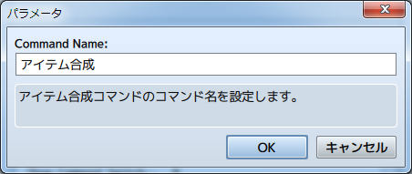
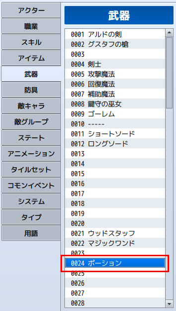
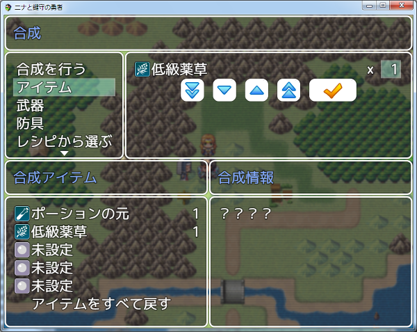
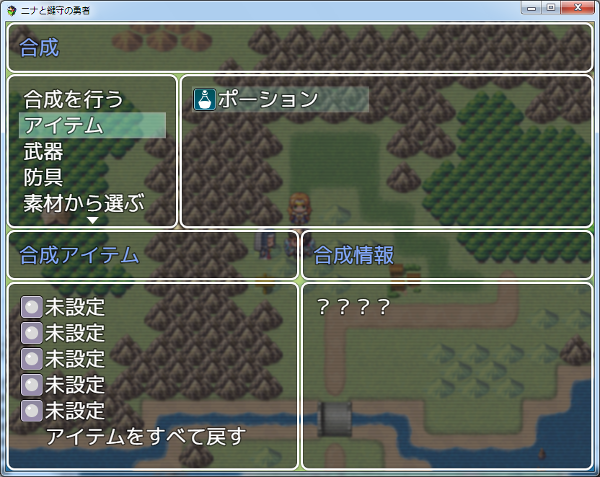
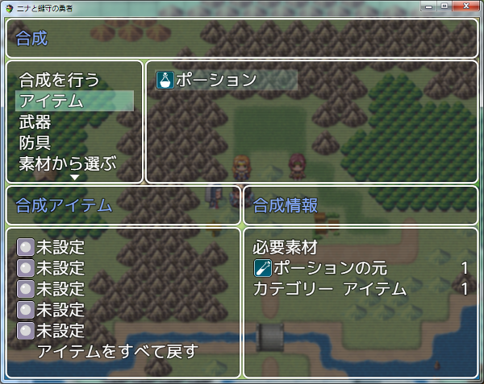
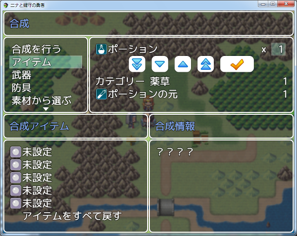
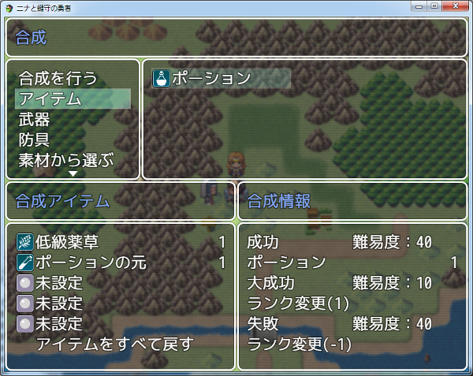
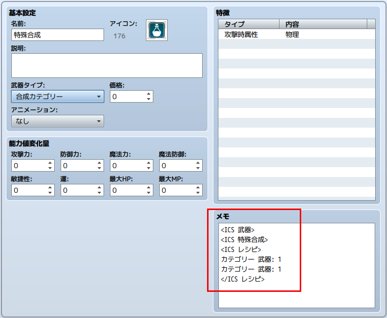

[トップページに戻る](README.md)

# [FTKR_ItemCompositionSystem](FTKR_ItemCompositionSystem.js) プラグイン

アイテム合成システムを実装するプラグインです。

ダウンロード: [FTKR_ItemCompositionSystem.js](https://raw.githubusercontent.com/futokoro/RPGMaker/master/FTKR_ItemCompositionSystem.js)

## 目次

以下の項目の順でプラグインの使い方を説明します。
1. [概要](#概要)
2. [基本設定](#基本設定)
    1. [アイテム合成画面を表示する](#アイテム合成画面を表示する)
    2. [アイテム合成時の設定](#アイテム合成時の設定)
3. [アイテムとレシピの設定](#アイテムとレシピの設定)
    1. [合成カテゴリーの設定](#合成カテゴリーの設定)
    2. [アイテムの設定](#アイテムの設定)
    3. [レシピの設定](#レシピの設定)
4. [合成の仕組み](#合成の仕組み)
    1. [合成の基本](合成の基本)
    2. [合成の成功率](#合成の成功率)
    3. [特殊合成](#特殊合成)
5. [レイアウトの設定](#レイアウトの設定)
    1. [合成コマンドの表示設定](#合成コマンドの表示設定)
6. [プラグインコマンド](#プラグインコマンド)
* [プラグインの更新履歴](#プラグインの更新履歴)
* [ライセンス](#ライセンス)

## 概要

本プラグインにより、アイテム合成システムを実装し、アイテム同士を合成して新たなアイテムを入手できるようになります。


[目次に戻る](#目次)

## 基本設定
## アイテム合成画面を表示する

専用画面は、以下の方法で表示できます。

### メニューから表示

プラグインパラメータ`Enabled Show Command`が 1 であることを確認してください。（デフォルトで設定済み）


この状態の時に、メニュー画面にコマンド「アイテム合成」が表示します。


コマンド「アイテム合成」の表示は、プラグインパラメータ`Command Name`で変更できます。



また、以下のプラグインパラメータでメニュー欄への表示の有無をスイッチで制御できます。

`Show Menue Switch ID`

0 を指定した場合は、この機能は無効です。
1 以上の値を設定した場合、そのIDのスイッチが ON 状態の時にメニューに表示します。


### プラグインコマンドを実行
以下のプラグインコマンドを実行することで、画面を表示します。
```
ICS_Open
ICS_合成画面表示
```

[目次に戻る](#目次)

## アイテム合成時の設定

### アイテム合成時の確認

`<Enable Confirmation>`

アイテム合成実行時に確認画面を表示して、実行するか確認するかを指定します。
 * 1 - 確認する
 * 0 - 確認しない


確認する場合は、アイテム合成実行時に下のウィンドウを表示します。


[目次に戻る](#目次)

## アイテムとレシピの設定
## 合成カテゴリーの設定

合成カテゴリーを使用することで、より柔軟なレシピを作成することができます。
レシピに特定のアイテムではなくカテゴリーを指定すると、同じカテゴリーのアイテムであればどのアイテムでも使用できるようになります。

### 合成カテゴリーIDの登録

合成カテゴリーを作成するために、まず「武器タイプ」に合成カテゴリー用のタイプを作成してください。
武器タイプ名を「合成カテゴリー」などと付けると、分かりやすくなると思います。

設定した武器タイプIDは、プラグインパラメータ`Category Type ID`に設定してください。


### 合成カテゴリーの作成

合成カテゴリーは、データベースの武器に作成します。



合成カテゴリーとして設定が必要なデータは以下の通りです。

1. 武器タイプには、先ほど登録した合成カテゴリーIDを選択してください。
2. 武器の名前が合成カテゴリーの名前として画面に表示します。
3. 武器のアイコンが合成カテゴリーのアイコンとして画面に表示します。
4. メモ欄に合成カテゴリー用のノートタグを追加してください。


合成カテゴリーは、以下のノートタグで設定を行います。

#### アイテム分類の設定
下記のいずれかを入力してください。
設定しない場合は、アイテムと見なします。
```
<ICS アイテム>
<ICS 武器>
<ICS 防具>
```

#### レシピの設定
レシピは、以下の記述で入力します。
レシピの内容については、レシピの設定を参照してください。
```
<ICS レシピ>
内容
</ICS レシピ>
```
このレシピによって出来上がるアイテムは、このレシピを設定した合成カテゴリーに属するアイテムの内、生成後のランクと同じランクのアイテムが選ばれます。

[目次に戻る](#目次)

## アイテムの設定

合成に使用するために、アイテムの設定を行います。
アイテムのメモ欄に合成用のノートタグを追加してください。


#### 合成カテゴリーの設定
以下のノートタグで、カテゴリーを設定できます。
カテゴリー名には、[合成カテゴリーの設定](#カテゴリーの設定)で作成したカテゴリー名を入力してください。
```
<ICS カテゴリー: カテゴリー名>
```

#### ランクの設定
以下のノートタグで、アイテムにランクを設定できます。
```
<ICS ランク: x>
アイテムのランクを x にする。
```
合成後にできるアイテムのランクは、素材に使用したアイテムのランクの平均値です。
ランク 0 のアイテムは、ランク計算には使いません。
このタグを設定しない場合は、ランク 0 と見なします。

#### 合成アイテムの設定
以下のノートタグで、アイテムを合成アイテムに設定できます。
合成アイテムは、カテゴリー設定が無効になります。
```
<ICS 合成アイテム>
```

#### レシピの設定
レシピは、以下の記述で入力します。
レシピの内容については、レシピの設定を参照してください。
```
<ICS レシピ>
内容
</ICS レシピ>
```

#### デフォルトカテゴリーについて
「合成アイテム」タグをつけたアイテム以外には、デフォルトカテゴリーが設定されています。

分類がアイテムの場合は、「アイテム」カテゴリー、武器の場合は「武器」カテゴリー、防具の場合は「防具」カテゴリーです。

これらのカテゴリーをレシピに設定すると、その分類のアイテムがすべて対象になります。
例えば武器カテゴリーならすべての武器が対象になります。

[目次に戻る](#目次)

## レシピの設定

アイテム合成システムを利用するためには、アイテムレシピの設定が必要です。
レシピは、一つのアイテムやカテゴリーに対して複数設定することができます。

レシピは、以下のノートタグで設定を行います。
```
<ICS レシピ>
内容
</ICS レシピ>
```

### 生成数の設定
合成でできあがるアイテムの数を y に設定します。
```
生成数: y
```

### 素材の設定
合成に必要な素材アイテムを設定します。
以下のいずれかの記述で入力してください。
```
アイテム[x]: y
武器[x]: y
防具[x]: y
アイテム名: y
カテゴリー カテゴリー名: y
```
* x - アイテムや武器等のID
* y - 必要な個数

### 合成難易度の設定
合成の難易度を数値で設定します。
大成功の難易度が x、成功が y、失敗が z です。
```
難易度: x, y, z
```

### 成功以外の合成結果の設定
大成功および失敗時の合成アイテムの内容を設定します。
入力しない場合は、発生しません。
例えば、大成功を入力しなければ、大成功しません。
```
大成功: 内容
失敗: 内容
```
以下の内容から選んで入力してください。

* `生成数変更(x)`
    * 生成数を変更します。負の値の場合は減ります。

* `ランク変更(x)`
    * 生成後のアイテムのランクを変更します。負の値の場合は減ります。
    * ランクが減ったことで 0 になる、またはそのランク以下のアイテムが
    ない場合は、何も生成しません。

* `カテゴリー変更(カテゴリー名)`
    * 生成後のアイテムのカテゴリーを変更します。
      変更後のカテゴリーの同ランクのアイテムになります。

* `アイテム変更(アイテム名)`
    * ランクやカテゴリーを無視して、指定したアイテムに変更します。

* `なし`
    * 何も生成しません。生成数を 0 に変更します。

入力例)
```
大成功: 生成数変更(3)
失敗: 生成数変更(1)
大成功の時に生成数が3に、失敗の時に生成数が1になる。
```

#### 合成の必要条件の設定
成功および大成功するために必要な条件を設定します。
この条件に満たない場合は、必ず失敗、または消失になります。
```
必要条件: 条件式
```
#### 条件式 の値について
条件式は、ダメージ計算式のように、計算式を入力することで、固定値以外の値を
使用することができます。以下のコードを使用できます。
* a[x].param - アクターID x のパラメータを参照します。
* s[x]    - スイッチID x の状態を参照します。
* v[x]    - 変数ID x の値を参照します。

[目次に戻る](#目次)

## 合成の仕組み

## 合成の基本

### 素材から選んでアイテムを合成する

合成画面では、下の図のように「アイテム」「武器」「防具」の分類で手持ちのアイテムを表示します。


アイテムを選択すると、合成素材に使用する員数を入力します。
入力が終わると、左下の合成アイテムのスロットにアイテムが移動します。



合成する素材が決まったら、「合成を行う」コマンドを実行します。
確認画面の有無は、プラグインパラメータで設定できます。

この合成は、レシピを知らなくても実行可能です。
レシピの素材と合っていれば、レシピの有無の関係なく、成功すれば合成アイテムを入手できます。


合成実行後は、下の図のような合成結果が表示します。


### レシピから選んでアイテムを合成する

素材から選ぶだけでなく、レシピから選んで合成することもできます。
コマンド「レシピから選ぶ」を選択すると、右側のアイテム欄が覚えているレシピの表示に変わります。



なお、プラグインパラメータ`Display Recipe Materials`を有効にしていると、合成情報ウィンドウに選択中のレシピの素材アイテムを表示します。



レシピを選択すると、生成する数の設定画面に映ります。
このとき、レシピの素材アイテムが表示します。



数の設定が終わると、レシピの素材アイテムがまとめて合成アイテムスロットに移ります。
また、レシピを覚えているため、右側の合成情報に合成時の詳細が表示します。

なお、この時表示する合成難易度値は、プラグインパラメータ`Display Difficulty`の設定で、非表示にすることができます。



合成実行後については、素材から選ぶ場合と変わりはありません。
なお、下の図のように、合成結果には「成功」だけでなく「大成功」や「失敗」「消失」があります。

図のレシピの場合、大成功時にアイテムランクが上がるように設定しています。
そのため、成功時に「ポーション」だったものが、大成功では「ハイポーション」に変わります。


[目次に戻る](#目次)

## 合成の成功率
合成の成功率は、合成して出来るアイテムの難易度と、パーティーのパラメータから算出します。

### 成功率の算出
成功率は、以下の計算式で大成功、成功、失敗で個別に算出します。

成功率 ＝ 成功値 / プラグインパラメータ`<Max Success Rate>`の設定値

成功値 ＝ プラグインパラメータ`<Success Base Rate>`の設定値 + 成功補正値

(難易度 < パラメータ の場合)<br>
成功補正値 ＝ 難易度とパラメータの差 × `<Upper Add Rate>`の設定値(正の値)

(難易度 > パラメータ の場合)<br>
成功補正値 ＝ 難易度とパラメータの差 × `<Downer Reduce Rate>`の設定値(負の値)

アイテムの合成難易度に対して、パラメータが高ければ成功率は上がり低い場合は成功率が下がるようになっています。


### 最終的な成功率の算出
最終的に、大成功、成功、失敗、消失のどれになるかについては以下の計算式から算出します。

大成功になる確率 ＝ 成功の成功率 × 大成功の成功率<br>
成功になる確率　 ＝ 成功の成功率 - 大成功になる確率<br>
失敗になる確率　 ＝ (1 - 成功の成功率) × 失敗の成功率<br>
消失になる確率　 ＝ (1 - 成功の成功率) - 失敗になる確率<br>

上の計算式で分かると思いますが、成功の成功率が基準になっています。


### パーティーのパラメータについて
プラグインパラメータ`<Composition Parameter>`で指定した計算式を使用します。

#### 計算式 の値
計算式は、ダメージ計算式のように、計算式を入力することで、
固定値以外の値を使用することができます。以下のコードを使用できます。
* a[x].param - アクターID x のパラメータを参照します。
* s[x]    - スイッチID x の状態を参照します。
* v[x]    - 変数ID x の値を参照します。

#### 設定例
プラグインパラメータおよび、アイテムの合成難易度の設定を以下とします。
```
<Max Success Rate>  : 100
<Success Base Rate> : 80
<Upper Add Rate>    : 2
<Downer Reduce Rate>: -5
難易度: 60,50,40
```
パラメータの値が 50 だった場合、合成結果の確率は以下のようになります。

「大成功」の成功値 ＝ 80 + 10 * -5 = 30<br>
「成功」の成功値　 ＝ 80<br>
「失敗」の成功値　 ＝ 80 + 10 * 2 = 100<br>

大成功になる確率 ＝ 30% * 80% = 24%<br>
成功になる確率　 ＝ 80% - 24% = 56%<br>
失敗になる確率　 ＝ 20% * 100% = 20%<br>
消失になる確率　 ＝ 20% - 20% = 0%<br>

### パラメータを設定しない場合の最終的な成功率
プラグインパラメータ`<Composition Parameter>`に、値を設定しない場合は、アイテムに設定した難易度がそのまま最終的な成功率になります。

#### 設定例
`<Max Success Rate>`の設定値がデフォルト(100)で、アイテムに以下のように設定した場合
```
難易度: 10,50,30
```
大成功になる確率 ＝ 10 / 100 = 10%<br>
成功になる確率　 ＝ 50 / 100 = 50%<br>
失敗になる確率　 ＝ 30 / 100 = 30%<br>
消失になる確率　 ＝ (100 - (10 + 50 + 30)) / 100 = 10%<br>

## 特殊合成

合成カテゴリーに`<ICS 特殊合成>`タグを設定すると、この特殊合成になります。
通常の合成とは異なり、合成仕様が変わります。

素材に使用できるアイテム分類は「武器」および「防具」だけです。



### 特殊合成の仕様

1. レシピの一つ目に設定した素材をベースアイテムとします。
2. レシピの二つ目以降に設定した素材を付加アイテムとします。
   なお、「合成アイテム」タグをつけたアイテムは除きます。
3. 合成してできるアイテムは、ベースアイテムに付加アイテムの性能を一部乗せたアイテムになります。
4. 特殊合成は、レシピから選ぶことはできません。
5. 特殊合成は、ランク変更、カテゴリー変更、アイテム変更は選べません。


### 合成してできるアイテムの仕様
1. アイテム分類および基本設定は、ベースアイテムと同じです。
2. 合成により、付加アイテムの能力値、または特徴をベースアイテムに付与します。
3. 付与する能力の数は、生成数に従います。
   生成数が 0 以下の場合は、何も付与しません。
4. ベースアイテムと同じ見た目ですが、ベースアイテムとは別物です。
   アイテムIDが異なりますので、武器・防具の所持数を取得する場合に別アイテムとして数えます。
5. オリジナルアイテムの名前は、「ベースアイテム名(+合成回数)」になります。

作成例）
ベースアイテムがショートソードで、合成回数が1回の場合に出来上がるアイテムは、「ショートソード(+1)」です。


[目次に戻る](#目次)

## レイアウトの設定

## 合成コマンドの表示設定

合成コマンドで表示するコマンドの表示項目と順番は
プラグインパラメータ`<Command List>`の設定で変更できます。

以下の文字列を入力した順番にコマンドを上から表示します。
入力する文字列は、必ず小文字にしてください。

 * action : 合成を実行するコマンド
 * item   : アイテム分類の選択コマンド(*1)
 * weapon : 武器分類の選択コマンド(*1)
 * armor  : 防具分類の選択コマンド(*1)
 * change : 右側のアイテムウィンドウに、アイテムを表示するか、レシピを表示するか変えるコマンド
 * slot   : 素材スロットのアイテムを戻すコマンド
 * end    : 合成を止めるコマンド


(*1)';'で入力したコマンド名を区切って２種類設定すると、素材選択時とレシピ選択時でコマンド名を変えることが出来ます。

入力例)
```
アイテム素材;アイテムレシピ
```
素材から選ぶ時はコマンド名が「アイテム素材」に、レシピから選ぶ時は「アイテムレシピ」に表示が変わります。

[目次に戻る](#目次)

## プラグインコマンド

### アイテム合成画面表示
```
ICS_Open [compositTitle] [slotTitle] [statusTitle] [commandList]
ICS_合成画面表示 [合成タイトル] [スロットタイトル] [情報タイトル] [コマンドリスト]
```
[]部の入力は必須ではありません。
入力した場合、プラグインパラメータの設定を無視して、合成画面の各表示に引数で設定した文字列を使用します。
タイトルの文字列に制御文字を使用できます。

コマンドリスト - プラグインパラメータ<Command List>と同じ入力方式です。

### レシピを追加
```
ICS_ADD_RECIPE [ITEMNAME] [RecipeId]
ICS_ADD_RECIPE [ITEM] [ItemId] [RecipeId]
ICS_レシピ追加 [アイテム名] [レシピID]
ICS_レシピ追加 [アイテム] [アイテムID] [レシピID]
```
'アイテム'部は、武器の場合は'武器'、防具の場合は'防具'と入力します。
指定したアイテムのレシピを覚えます。

アイテム名や、アイテム、アイテムID部に、v[n]と入力することで、
ゲーム内変数ID n の内容を参照できます。
レシピIDを入力しない場合は、指定したアイテムの1つめのレシピになります。

入力例) アイテムID11 がポーションの場合、以下は同じ結果になります。
```
ICS_レシピ追加 ポーション 1
ICS_レシピ追加 アイテム 11 1
```

### レシピを削除
```
ICS_REDUCE_RECIPE [ITEMNAME] [RecipeId]
ICS_REDUCE_RECIPE [ITEM] [ItemId] [RecipeId]
ICS_レシピ削除 [アイテム名] [レシピID]
ICS_レシピ削除 [アイテム] [アイテムID] [レシピID]
```
'アイテム'部は、武器の場合は'武器'、防具の場合は'防具'と入力します。
指定したアイテムのレシピを忘れます。

アイテム名や、アイテム、アイテムID部に、v[n]と入力することで、
ゲーム内変数ID n の内容を参照できます。
レシピIDを入力しない場合は、指定したアイテムの1つめのレシピになります。

入力例) アイテムID11 がポーションの場合、以下は同じ結果になります。
```
ICS_レシピ削除 ポーション 1
ICS_レシピ削除 アイテム 11 1
```

[目次に戻る](#目次)

## プラグインの更新履歴

| バージョン | 公開日 | 更新内容 |
| --- | --- | --- |
| [ver1.2.0](FTKR_ItemCompositionSystem.js) | 2017/08/29 | １つのアイテムに複数設定したレシピを正しく読み取れない不具合を修正<br>合成コマンドの、「アイテム」「武器」「防具」の表示名を素材選択時とレシピ選択時で変える機能を追加 |
| ver1.1.0 | 2017/08/21 | 合成コマンドの、「アイテム」「武器」「防具」の表示名をプラグインパラメータで設定できる機能を追加<br>合成レシピと使用素材の合致条件を設定する機能を追加<br>素材を何もセットしていない場合に、合成実行できないように変更 |
| ver1.0.6 | 2017/08/19 | 確認ウィンドウを無効にして合成を実行するとエラーになる不具合を修正 |
| ver1.0.5 | 2017/07/12 | レシピ素材が１種類でも合成できるように変更 |
| ver1.0.4 | 2017/07/07| プラグインコマンドで、レシピIDを指定しない場合に正しく処理できない不具合を修正 |
| ver1.0.3 | 2017/06/28| 合成情報ウィンドウに必要レシピを表示する機能が、正しく動作しない不具合を修正<br>素材数指定ウィンドウに、必要レシピを表示するかどうか設定するプラグインパラメータを追加 |
| ver1.0.2 | 2017/06/27| レシピタグで難易度を設定すると、正しく反映されない不具合を修正 |
| ver1.0.1 | 2017/06/27| ヘルプ修正 |
| ver1.0.0 | 2017/06/26 | レシピから選んで生成数を設定しても、スロットに正しい素材員数がセットされない不具合を修正<br>合成画面の表示コマンドの機能拡張<br>コマンド名を設定するプラグインパラメータの名称変更<br>プラグインコマンドの表記変更 |
| ver0.9.4 | 2017/06/11 | 合成情報ウィンドウの難易度表示をON/OFFする機能を追加<br>レシピから選ぶ場合、合成情報ウィンドウに必要レシピを表示する機能を追加 |
| ver0.9.3 | 2017/06/08 | 投入したアイテムが何のレシピにも該当しない場合に、使用したアイテムが戻る処理を追加 |
| ver0.9.2 | 2017/04/13 | 特殊合成を追加 |
| ver0.9.1 | 2017/04/13 | 不具合修正、デフォルトカテゴリーを追加 |
| ver0.9.0 | 2017/04/08 | 試作版公開 |

## ライセンス

本プラグインはMITライセンスのもとで公開しています。

[The MIT License (MIT)](https://opensource.org/licenses/mit-license.php)

#
[目次に戻る](#目次)

[トップページに戻る](README.md)