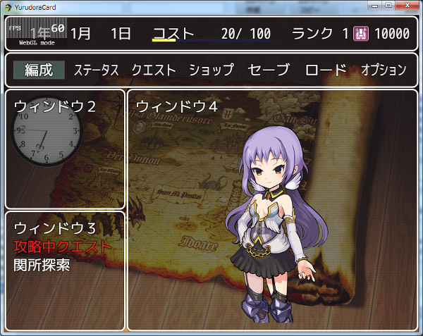

[トップページに戻る](README.md)

# [FTKR_OriginalSceneWindow](FTKR_OriginalSceneWindow.js) プラグイン

オリジナルのシーンやウィンドウを作成するプラグインです。

ダウンロード: [FTKR_OriginalSceneWindow.js](https://raw.githubusercontent.com/futokoro/RPGMaker/master/FTKR_OriginalSceneWindow.js)

## 目次

以下の項目の順でプラグインの使い方を説明します。
1. [概要](#概要)
1. [ウィンドウのプライオリティについて](#ウィンドウのプライオリティについて)
1. [オリジナルシーンの表示](#オリジナルシーンの表示)
1. [コモンウィンドウを表示する](#コモンウィンドウを表示する)
1. [コマンドウィンドウを表示する](#コマンドウィンドウを表示する)
* [プラグインの更新履歴](#プラグインの更新履歴)
* [ライセンス](#ライセンス)

## 概要

オリジナルのシーンやウィンドウを作成します。

1. オリジナルシーンの簡易作成機能
2. オリジナルシーンおよびマップシーン、バトルシーンにおけるウィンドウの作成機能

作成できるウィンドウは、以下の２種類です。
1. コマンドウィンドウ - シーン変更やコモンイベントを実行するコマンドを表示
2. コモンウィンドウ　 - さまざまな文字列や数値、画像などを表示(*1)

(*1) コモンウィンドウに、文字列以外を表示させたい場合は FTKR_CustomSimpleActorStatus.js が必要です。

サンプル画像



画像の立ち絵は、ゆるドラシルのキャラクターです
 ©2014 CloverLab.,Inc.

[目次に戻る](#目次)

## ウィンドウのプライオリティについて
オリジナルシーンとマップシーンの場合は、独立したレイヤーに表示します。
レイヤーのプライオリティは以下の通りです。

オリジナルシーンの場合
```
背景 ＜ 当プラグインレイヤー ＜ デフォルトレイヤー
```

マップシーンの場合
```
マップスプライト ＜ 当プラグインレイヤー ＜ マップ名
          ＜ デフォルトレイヤー ＜ スクリーンスプライト
```

当プラグインのウィンドウ間のプライオリティは、生成コマンドを実行した順番です。
つまり、後に生成したウィンドウの方が手前に表示されます。

バトルシーンの場合は、デフォルトレイヤーに追加します。

バトルシーンの場合(デフォルトレイヤー内)
```
ログウィンドウ ＜ 当プラグインウィンドウ ＜ ステータスウィンドウ ＜ ...
```

当プラグインのウィンドウ間のプライオリティは、ウィンドウID順です。
ウィンドウIDが大きい方が手前に表示されます。

## オリジナルシーンの表示
以下のプラグインコマンドを実行すると、オリジナルシーンを表示します。

```
OSW_オリジナルシーン表示
OPEN_ORIGINAL_SCENE
```
オリジナルシーンは、デフォルトでは何も表示しません。

コマンドウィンドウやコモンウィンドウを追加する場合は
以降の設定方法に従い、オリジナルシーンの設定を行ってください。

## コモンウィンドウを表示する

### コモンウィンドウを生成する数を設定する
コモンウィンドウの生成数はプラグインパラメータで設定します。

`Common Number In Original`

オリジナルシーンでの生成数

`Common Number In Map`

マップシーンでの生成数

`Common Number In Battle`

バトルシーンでの生成数

### 生成したコモンウィンドウの設定

```
OSW_コモン設定 [シーン名] [ウィンドウID] [設定内容]
OSW_SET_COMMON [scene] [windowId] [setting]
```
[シーン名]に、以下を設定してください。
* オリジナル or ORIGINAL - オリジナルシーンを設定する
* マップ or MAP - マップシーンを設定する
* バトル or BATTLE - バトルシーンを設定する

[ウィンドウID]で、設定するウィンドウのIDを指定します。

[設定内容]には、以下があります。
この設定は、プラグインパラメータの設定よりも優先します。

#### ウィンドウの生成
```
生成
CREATE
```
ウィンドウを生成します。
オリジナルシーンおよびマップシーンでのみ使用できます。
このパラメータは単独で使用してください。

#### 表示位置の設定
```
位置 [x] [y]
POSITION [x] [y]
```
ウィンドウの表示位置を pixel単位 で指定します。<br>
x に -1 を入力すると、ウィンドウサイズに合わせて画面右寄せします。<br>
y に -1 を入力すると、ウィンドウサイズに合わせて画面下寄せします。

#### ウィンドウサイズの設定
```
サイズ [width] [height]
SIZE [width] [height]
```
ウィンドウのサイズを pixel単位 で指定します。<br>
width に -1 を入力すると、画面の幅に合わせます。<br>
height に -1 を入力すると、画面の高さに合わせます。

#### フォントサイズの設定
```
フォントサイズ [value]
FONTSIZE [value]
```
ウィンドウのフォントサイズを pixel単位 で指定します。

#### 行の高さの設定
```
行の高さ [value]
LINEHEIGHT [value]
```
ウィンドウの１行の高さを pixel単位 で指定します。

#### ウィンドウの余白の設定
```
余白 [value]
PADDING [value]
```
ウィンドウの周囲の余白を pixel単位 で指定します。

#### ウィンドウ背景の透明度の設定
```
透明度 [value]
OPACITY [value]
```
ウィンドウ背景の透明度を指定します。

#### フレームの表示設定
```
フレーム [表示 or 非表示]
FRAME [SHOW or HIDE]
```
ウィンドウのフレームを表示するかどうか設定します。
(デフォルトでは表示)

#### アクターの設定
```
アクター [アクターID]
ACTOR [actorId]
```
ウィンドウ内で表示するパラメータの参照元のアクターを指定します。
アクターIDには、\V[x]でゲーム内変数を使用できます。

#### 表示内容の設定(FTKR_CustomSimpleActorStatusなし)
```
テキスト [行数] [表示する文字列]
TEXT [line] [displayText]
```
ウィンドウに表示する文字列を設定します。
行数で、文字列を何行目(最上段を0とする)に表示するか指定します。
制御文字を使用できます。

FTKR_CustomSimpleActorStatus.js と組み合わせている場合には、この記述は使用できません。

```
テキスト初期化
CLEAR_TEXT
```
設定したテキストをすべて初期化します。

#### 表示内容の設定(FTKR_CustomSimpleActorStatusあり)
```
内容 [表示内容]
CONTENT [contentSetting]
```
FTKR_CustomSimpleActorStatus.js と組み合わせている場合に使用可能な記述です。

[表示内容]には以下の記述で設定します。

```
ステータス [表示させるステータス]
STATUS [displayStatus]
```
Actor Status Text1 ~ 3に相当する設定です。
セミコロン(;)でText1,Text2,Text3の内容を区切って入力してください。

```
描画間隔 [値1,値2,値3,値4]
DRAW_SPACE [value1,value2,value3,value4]
```
Actor Status Space に相当する設定です。
カンマ(,)で区切って、入力してください。

```
並列間隔 [値]
PARALEL_SPACE [value]
```
Actor Status Space In Text に相当する設定です。

```
幅比率 [表示させるステータス]
WIDTH_RATE [表示させるステータス]
```
Actor Status Width Rate に相当する設定です。
カンマ(,)で区切って、入力してください。

#### 表示の更新
```
更新
REFRESH
```
設定内容をウィンドウに反映させます。
位置やサイズなど、設定した後には更新が必要です。

#### 表示の設定
```
表示 [ON or OFF]
SHOW [ON or OFF]
```
ウィンドウの表示のON/OFFを切り替えます。
基本的に最後に設定してください。

[目次に戻る](#目次)

## コマンドウィンドウを表示する

### コマンドウィンドウを生成する数を設定する
コマンドウィンドウの生成数はプラグインパラメータで設定します。

`Command Number In Original`

オリジナルシーンでの生成数

`Command Number In Map`

マップシーンでの生成数

### 生成したコマンドウィンドウの設定

```
OSW_コマンド設定 [シーン名] [ウィンドウID] [設定内容]
OSW_SET_COMMON [scene] [windowId] [setting]
```
[シーン名]に、以下を設定してください。
* オリジナル or ORIGINAL - オリジナルシーンを設定する
* マップ or MAP - マップシーンを設定する

[ウィンドウID]で、設定するウィンドウのIDを指定します。

[設定内容]には、以下があります。
この設定は、プラグインパラメータの設定よりも優先します。

#### ウィンドウの生成
```
生成
CREATE
```
ウィンドウを生成します。
オリジナルシーンおよびマップシーンでのみ使用できます。
このパラメータは単独で使用してください。

#### 表示位置の設定
```
位置 [x] [y]
POSITION [x] [y]
```
ウィンドウの表示位置を pixel単位 で指定します。<br>
x に -1 を入力すると、ウィンドウサイズに合わせて画面右寄せします。<br>
y に -1 を入力すると、ウィンドウサイズに合わせて画面下寄せします。

#### ウィンドウサイズの設定
```
サイズ [width]
SIZE [width]
```
ウィンドウのサイズを pixel単位 で指定します。<br>
width に -1 を入力すると、画面の幅に合わせます。<br>
ウィンドウの高さは、設定したコマンドの数と最大列数により決まります。

#### 最大列数の設定
```
最大列数 [value]
MAX_COLS [value]
```
コマンドを横に並べる数を設定します。
デフォルトは１です。

#### コマンドの表示位置の設定
```
コマンド位置 [align]
COMMAND_ALIGN [align]
```
ウィンドウ枠内で、コマンド名を表示する位置を設定します。
* left   - 左寄せ
* center - 中央
* right  - 右寄せ

デフォルトは左寄せです。

#### フォントサイズの設定
```
フォントサイズ [value]
FONTSIZE [value]
```
ウィンドウのフォントサイズを pixel単位 で指定します。

#### 行の高さの設定
```
行の高さ [value]
LINEHEIGHT [value]
```
ウィンドウの１行の高さを pixel単位 で指定します。

#### ウィンドウの余白の設定
```
余白 [value]
PADDING [value]
```
ウィンドウの周囲の余白を pixel単位 で指定します。

#### ウィンドウ背景の透明度の設定
```
透明度 [value]
OPACITY [value]
```
ウィンドウ背景の透明度を指定します。

#### フレームの表示設定
```
フレーム [表示 or 非表示]
FRAME [SHOW or HIDE]
```
ウィンドウのフレームを表示するかどうか設定します。
(デフォルトでは表示)

#### コマンドの初期化
```
コマンド初期化
CLEAR_COMMAND
```
設定したコマンドをすべて初期化します。

#### コマンドの追加
```
コマンド追加 [コマンド名] [シンボル名] [実行条件] [メソッド]
ADD_COMMAND [name] [symbol] [enabled] [method]
```
コマンドを追加します。
なお、オリジナルシーンでは、デフォルトで「閉じる」コマンドを
設定しています。

[実行条件]<br>
true と入力すると、常にコマンドを実行できます。
JS計算式を入力すると、実行条件を動的に変えることができます。

[メソッド]の入力例
```
シーン変更(scene)
CHANGE_SCENE(scene)
```
コマンドを実行すると、scene で指定したシーンを表示します。<br>
sceneの例)
* Scene_Item  - アイテムシーン
* Scene_Skill - スキルシーン

```
コモンイベント(イベントId)
COMMON_EVENT(eventId)
```
コマンドを実行すると、イベントID で指定したコモンイベント実行します。

#### コマンドウィンドウのアクティブ設定
```
アクティブ [ON or OFF]
ACTIVE [ON or OFF
```
コマンドウィンドウを選択可能な状態にするかどうか設定します。
複数のコマンドウィンドウを表示させる場合には、アクティブをONにするウィンドウは一つだけにしてください。

メッセージウィンドウを表示させる時には、アクティブをOFFに設定してください。

#### 表示の更新
```
更新
REFRESH
```
設定内容をウィンドウに反映させます。
位置やサイズなど、設定した後には更新が必要です。

#### 表示の設定
```
表示 [ON or OFF]
SHOW [ON or OFF]
```
ウィンドウの表示のON/OFFを切り替えます。
基本的に最後に設定してください。

[目次に戻る](#目次)

## プラグインの更新履歴

| バージョン | 公開日 | 更新内容 |
| --- | --- | --- |
| [ver1.0.0](FTKR_OriginalSceneWindow.js) | 2017/06/17 | 初版公開 |

## ライセンス

本プラグインはMITライセンスのもとで公開しています。

[The MIT License (MIT)](https://opensource.org/licenses/mit-license.php)

#
[目次に戻る](#目次)

[トップページに戻る](README.md)