[トップページに戻る](README.ja.md)

# [FTKR_SkillTreeSystem](FTKR_SkillTreeSystem.js) プラグイン

ツリー型のスキル習得システムを実装するプラグインです。

ダウンロード: [FTKR_SkillTreeSystem.js](https://raw.githubusercontent.com/futokoro/RPGMaker/master/FTKR_SkillTreeSystem.js)

## 目次

以下の項目の順でプラグインの使い方を説明します。
1. [概要](#概要)
2. [基本設定](#基本設定)
    1. [スキル習得画面を表示する](#スキル習得画面を表示する)
    2. [スキルポイントの設定](#スキルポイントの設定)
    3. [スキルの複数回習得機能](#スキルの複数回習得機能)
    4. [スキル習得時の設定](#スキル習得時の設定)
    5. [スキルを忘れた時の設定](#スキルを忘れた時の設定)
3. [スキルツリーの設定](#スキルツリーの設定)
    1. [スキルツリーの設定方法](#スキルツリーの設定方法)
    2. [スキルの設定](#スキルの設定)
    3. [スキルツリーをアクターとクラスに登録する](#スキルツリーをアクターとクラスに登録する)
    4. [スキルツリーの初期化](#スキルツリーの初期化)
4. [レイアウトの設定](#レイアウトの設定)
    1. [スキルツリーの表示設定](#スキルツリーの表示設定)
    2. [スキル表示設定](#スキル表示設定)
    3. [ウィンドウの表示設定](#ウィンドウの表示設定)
5. [その他の機能](#その他の機能)
    1. [制御文字の追加](#制御文字の追加)
6. [スクリプトコマンド](#スクリプトコマンド)
7. [プラグインコマンド](#プラグインコマンド)
* [プラグインの更新履歴](#プラグインの更新履歴)
* [拡張プラグイン](#拡張プラグイン)
* [ライセンス](#ライセンス)

## 概要

本プラグインにより、スキル習得システムの専用画面を表示し、視覚的にスキルを習得することができるようになります。

また、アクター毎にスキル習得時に使用できるスキルポイント(SP)を実装します。


[目次に戻る](#目次)

## 基本設定
## スキル習得画面を表示する

専用画面は、以下の方法で表示できます。

### メニューから表示

プラグインパラメータ`Show Skill Command`が 1 であることを確認してください。（デフォルトで設定済み）

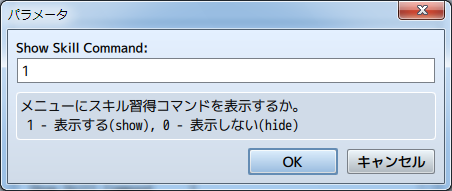

この状態の時に、メニュー画面にコマンド「スキル習得」が表示します。


コマンド「スキル習得」の表示は、プラグインパラメータ`Command Name`で変更できます。


また、以下のプラグインパラメータでメニュー欄への表示の有無をスイッチで制御できます。

`Skill Menue Switch ID`

0 を指定した場合は、この機能は無効です。
1 以上の値を設定した場合、そのIDのスイッチが ON 状態の時にメニューに表示します。


### プラグインコマンドを実行
以下のプラグインコマンドを実行することで、画面を表示します。
```
STS Open
STS スキルツリー画面表示
```

[目次に戻る](#目次)

## スキルポイントの設定

スキルを習得するためのコストとして、本プラグイン専用に、スキルポイント
というパラメータを用意しています。

### レベルアップ時の設定

スキルポイントは、レベルアップ時に入手できます。
以下のプラグインパラメータで入手量を設定できます。

`Get Level Up Sp`

レベルアップ時の入手SPを eval で設定します。

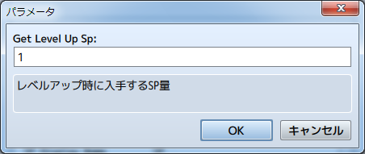

#### eval の値について
eval部は、ダメージ計算式のように、計算式を入力することで、固定値以外の値を
使用することができます。以下のコードを使用できます。
* a.param - 使用者のパラメータを参照します。(a.atk で使用者の攻撃力)
* s[x]    - スイッチID x の状態を参照します。
* v[x]    - 変数ID x の値を参照します。

### プラグインコマンドによる取得

以下のプラグインコマンド(Plugin Command)で、SPを取得できます。

```
STS Add Sp(x) Actor(y)
STS 加算 Sp(x) アクター(y)
```
アクターID y に、SPを x 加算する。
 x および y には、 v[n] とすることでゲーム内変数ID n の値を指定できます。

入力例)
```
STS Add Sp(v[1]) Actor(2)
STS 加算 Sp(v[1]) アクター(2)
アクター2が、変数ID1に格納した値の分、SPを取得する。
```

### アイテムによる取得
以下のタグをアイテム(Item)に設定できます。
```
<STS Get Sp: x>
```
アイテムを使用した対象が、SPを x 取得する。

### 敵から取得

以下のタグをエネミー(Enemy)に設定できます。
```
<STS Get Sp: x>
```
設定したエネミーを倒すと、SPを x 取得する。
 
 [目次に戻る](#目次)

## スキルの複数回習得機能

#### 最大習得回数の有効化

以下のプラグインパラメータにより、スキルを複数回習得できるようになります。

`Enabled Skill Count`

複数回習得機能を有効にするかどうか設定します。

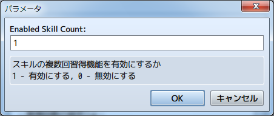

#### 最大習得回数の設定
スキルのタグに以下を追加することで、スキルの習得回数を設定できます。
```
<Set Sts Data>
Max count: x
</Set Sts Data>
```
スキルを x 回習得できるようにする。
このタグがない場合は、プラグインパラメータ`Default Max Count`の設定値に従います。


#### 習得回数の取得
スキルの習得回数は、以下のプラグインコマンドで取得できます。
```
STS Get Varcount(x) Actor(y) Skill(z)
STS 習得回数取得 変数(x) アクター(y) スキル(z)
```
アクターID y のスキルID z の取得回数を、変数ID x に格納する。
y および z には、 v[n] と入力することでゲーム内変数ID n の値を指定できます。

入力例)
```
STS 習得回数取得 変数(5) アクター(2) スキル(v[6])
アクターID 2 の、変数ID 6 の値で指定するスキルIDの習得回数を、変数ID 5 に格納する。
```

#### 習得回数の利用
スキルの取得回数は、各ステータスのeval式に使用できます。

eval式に対して、以下のコードを使用できます。
* a.stsCount(x) - スキルID x の習得回数を参照します。

この機能により、習得回数によって有効にすることや、ステータスの値自体を変える、といった使い方ができます。

[目次に戻る](#目次)

## スキル習得時の設定

### スキル習得時の確認

`<Enable Confirmation>`

スキル習得実行時に確認画面を表示して、実行するか確認するかを指定します。
 * 1 - 確認する
 * 0 - 確認しない

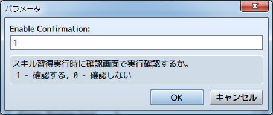

確認する場合は、スキル習得実行時に下のウィンドウを表示します。

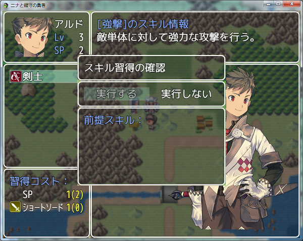

### スキル習得時のSEの設定

スキル習得時に鳴らすSEは種類、音量、ピッチ、位相を変更可能です。
以下のプラグインパラメータで書式を変更できます。

`<Learn SE Name>`

SEに使用する種類を変更します。使用したいSE名を記載してください。

`<Learn SE Volume>`

SEの音量を変更します。

`<Learn SE Pitch>`

SEのピッチを変更します。

`<Learn SE Pan>`

SEの位相を変更します。


### 変数およびスイッチの操作機能

以下のプラグインパラメータを設定することで、スキル習得時のアクターとスキルの
情報を取得できます。

`<Learned Actor Var ID>`

スキルを習得したアクターのIDを格納する変数IDを指定します。

`<Learned Skill Var ID>`

習得したスキルのIDを格納する変数IDを指定します。


[目次に戻る](#目次)

## スキルを忘れた時の設定

以下のプラグインパラメータを設定することで、スキルを忘れた時の動作を変更できます。

`<Reset When Forgotten Skill>`

スキルを忘れた時にツリーをリセットするかを指定します。
* 1 - リセットする
* 0 - リセットしない

リセットしない場合、スキルを忘れてもスキルツリーでは習得済みの状態のままになります。スキルを再習得するためには、ツリーのリセットまたは初期化が必要になります。


[目次に戻る](#目次)

## スキルツリーの設定
## スキルツリーの設定方法

ツリー型のスキル習得システムを利用するために、まずスキルツリーの設定が必要です。

### スキルツリーIDの登録

スキルツリーを作成するために、まず「武器タイプ」にスキルツリー用のタイプを作成してください。
武器タイプ名を「スキルツリー」などと付けると、分かりやすくなると思います。


### スキルツリーの作成

スキルツリーは、データベースの武器に作成します。
作成した武器のIDが、後述のツリータイプIDになります。


スキルツリーとして設定が必要なデータは以下の通りです。

1. 武器タイプには、先ほど登録したスキルツリーIDを選択してください。
2. 武器の名前がスキルツリーの名前として画面に表示します。
3. 武器のアイコンがスキルツリーのアイコンとして画面に表示します。
4. メモ欄にスキルツリー用のノートタグを追加してください。


スキルツリーは、以下のノートタグで設定を行います。
```
<Set Sts Data>
code
</Set Sts Data>
```

#### code に使用できる項目

`skill: x1,x2,...`

スキルツリーの起点となるスキルとして、ID x1,x2,...を登録します。
複数のIDを登録することで、複数の起点を持ったツリーにすることができます。
なお、IDの代わりに'0'を入力すると、その箇所はツリー上で空欄になります。
```
skill: 5,6
起点となるスキルを、スキルID5、6に設定する。
```

`required: eval`

スキルツリーの表示条件を eval に設定します。
```
required: a.level >= 3
スキルツリーを表示するために、レベル3以上必要。
```

#### eval の値について

eval部は、ダメージ計算式のように、計算式を入力することで、固定値以外の値を
使用することができます。以下のコードを使用できます。
* a.param - 使用者のパラメータを参照します。(a.atk で使用者の攻撃力)
* s[x]    - スイッチID x の状態を参照します。
* v[x]    - 変数ID x の値を参照します。
* a.stsCount(x) - スキルID x の習得回数を参照します。

[目次に戻る](#目次)

## スキルの設定

スキルツリーを作成した後に、ツリーを構成するスキルの設定を行います。
ツリーを構成させる各スキルのメモ欄にスキル用のノートタグを追加してください。


スキルは、以下のノートタグで設定を行います。
```
<Set Sts Data>
code
</Set Sts Data>
```

#### code に使用できる項目

`skill: y1,y2,...`

`tree x skill: y1,y2,...`

そのスキルから派生するスキルとして、スキルID y1,y2,...を登録します。
tree x を加えた場合は、スキルツリーID x に対する派生先として登録します。
`tree 0 skill: y1,y2,...`と、`skill: y1,y2,...`の意味は同じです。

なお、複数のスキルから同じスキルに派生するように設定した場合、派生元のスキルをすべて習得しなければ、その派生スキルは、習得できません。

以下の例の場合、スキルCを習得するために、スキルAとスキルBをどちらも習得しなければいけません。
1. スキルAの派生スキルにスキルCを登録
2. スキルBの派生スキルにスキルCを登録

入力例）
```
skill: 56,53,64
tree 5 skill: 55,65
スキルID56、53、64に派生する。ただしスキルツリーID5ではスキルID55、65に派生する。
```

`required: eval`

スキルの習得条件を eval に設定します。

入力例）
```
required: a.level >= 3
習得するために、レベル3以上が必要。
```

`cost sp: eval`

習得に必要なSP を eval に設定します。
このコードで設定しない場合は、プラグインパラメータ`Default Required SP`の設定値を使用します。

入力例）
```
cost sp: a.stsCount(10) + 1
習得に必要なSPを スキルID10の習得回数 + 1 に設定する。
```

`cost item[x]: eval`

`cost weapon[x]: eval`

`cost armor[x]: eval`

それぞれ習得に必要なアイテム、武器、防具を eval 個に設定します。

入力例）
```
cost item[10]: 1
習得に必要なアイテムID10を 1個に設定する。
```

`cost v[x]: eval`

習得に必要な変数ID x の値を eval に設定します。

入力例）
```
cost v[5]: 2
習得に必要な変数ID5の値を 2に設定する。
```

`cost gold: eval`

習得に必要な金を eval に設定します。

入力例）
```
cost gold: 100
習得するために、金100が必要。
```

`max count: y`

最大習得回数を y に設定します。
このタグがない場合は、プラグインパラメータ`Default Max Count`の設定値に従います。

入力例）
```
max count: 9
最大習得回数を 9 に設定します。
```

#### eval の値について

eval部は、ダメージ計算式のように、計算式を入力することで、固定値以外の値を使用することができます。以下のコードを使用できます。

* a.param - 使用者のパラメータを参照します。(a.atk で使用者の攻撃力)
* s[x]    - スイッチID x の状態を参照します。
* v[x]    - 変数ID x の値を参照します。
* a.stsCount(x) - スキルID x の習得回数を参照します。

#### スキルツリーの作成における注意事項

1つのスキルツリーの中で、同じスキルを重複して使用することはできません。
スキルが重複した場合、ツリーの終点に近い方を登録します。

[目次に戻る](#目次)

## スキルツリーをアクターとクラスに登録する

作成したスキルツリーは、アクターまたはクラスに登録することで使用できます。

### アクターとクラスの初期設定

アクターまたはクラスのメモ欄にノートタグを追加してください。


アクターとクラスは、以下のノートタグで設定を行います。

```
<Set Sts Data>
code
</Set Sts Data>
```

#### code に使用できる項目

`TreeType: x1,x2,...`

そのアクター、またはクラスは、ツリータイプID x1,x2,...を使用できます。
ツリータイプIDとは、ツリーとして作成した武器のIDです。

入力例）
```
TreeType: 9
アクターの初期ツリータイプIDを 9 に設定します。
```

`Init Sp: x`

アクターの初期SPを x に設定します。
このタグは、アクター専用です。

入力例）
```
Init Sp: 5
初期SPを 5 に設定します。
```

### ゲーム中のツリータイプの追加・削除

以下のプラグインコマンドを実行することで、ゲーム中にスキルツリーの追加・削除ができます。

アクターID y にツリータイプID x を追加します。
```
STS ADD TreeType(x) Actor(y)
STS 追加 ツリータイプ(x) アクター(y)
```

アクターID y の、ツリータイプID x を削除します。
ただし、初期設定したツリータイプは削除できません。

```
STS REDUCE TreeType(x) Actor(y)
STS 削除 ツリータイプ(x) アクター(y)
```

[目次に戻る](#目次)

## スキルツリーの初期化

スキルツリーは、ゲーム中にいくつかの手段で習得状況を初期状態に戻すことができます。
なお、リセットと初期化は使用したSPが戻るか戻らないかの違いです。

### プラグインコマンドで戻す

#### スキルツリーのリセット

以下のプラグインコマンドで、スキルツリーをリセットできます。
使用したSPはすべて戻ります。

```
STS Reset Actor(x) ALL
STS リセット アクター(x) すべて
アクターID x のスキルツリーをすべてリセットします。
```

```
STS Reset Actor(x) TreeType(y)
STS リセット アクター(x) ツリータイプ(y)
アクターID x のスキルツリーID y をすべてリセットします。
```

#### スキルツリーの初期化

以下のプラグインコマンドで、スキルツリーを初期化できます。
使用したSPは戻りません。

```
STS Clear Actor(x) ALL
STS 初期化 アクター(x) すべて
アクターID x のスキルツリーをすべて初期化します。
```

```
STS Clear Actor(x) TreeType(y)
STS 初期化 アクター(x) ツリータイプ(y)
アクターID x のスキルツリーID y をすべて初期化します。
```

### アイテムで戻す

また、以下のタグをアイテムのノート欄に入力することで、ツリーを初期化する
アイテムにできます。

```
<STS Reset Tree>
```
対象のスキルツリーをすべてリセットします。
使用したSPはすべて戻ります。

```
<STS Clear Tree>
```
対象のスキルツリーをすべて初期化します。
使用したSPは戻りません。

[目次に戻る](#目次)

## レイアウトの設定

## スキルツリーの表示設定

以下のプラグインパラメータの設定を変更することで、スキルツリーの表示を変えることができます。

`<Skill Tree Max Cols>`

スキルを横に並べられる最大数の設定します。

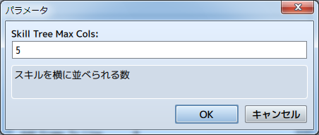

`<Skill Tree Height Space>`

スキルの縦の間隔を指定します。

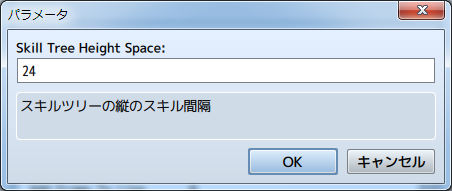

`<Draw Line Type>`

スキル間の線の引き方を指定します。
* 1 - カギ線(デフォルト)
* 0 - 直線

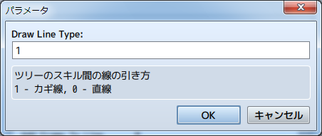

直線にした場合、スキルツリーは下のようになります。

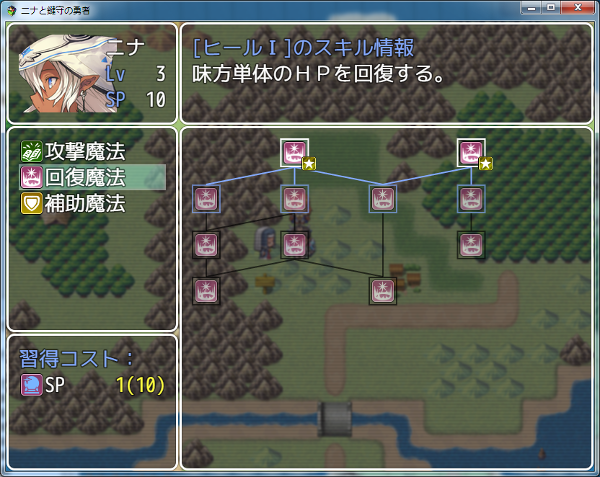

`<Tree Line Thick>`

ツリーの線の太さを指定します。

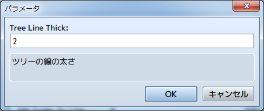

下の図は、左側が太さ 2 (デフォルト)、右側が太さ 4 です。
図のように、枠線の太さも変わります。


`<Add Frame To Line>`

ツリーの線に黒枠を付けるかどうか指定します。
* 1 - 付ける
* 0 - 付けない(デフォルト)

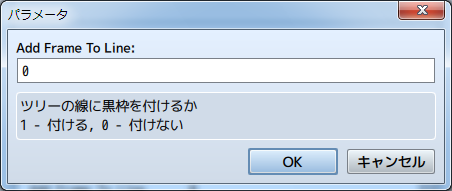

下の図は、左側が黒枠無し(デフォルト)、右側が黒枠有りです。
分かりやすくするため、線の太さを4にしています。


`<Fit Line Color To Frame>`

スキル間の線の色を枠の色に合わせるか指定します。
* 1 - 合わせる(デフォルト)
* 0 - 合わせない

合わせないにした場合は、スキル間の線の色は白になります。


[目次に戻る](#目次)

## スキル表示設定

スキルの表示は、以下で構成します。
1. スキル枠
2. スキルアイコン
3. スキルテキスト(デフォルトでは非表示)
4. スキルカウント枠(習得回数)

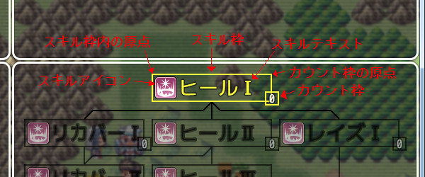

### スキル枠の設定

スキル枠には、以下の3種類の項目があります。
以下のプラグインパラメータで設定を変えることができます。

#### スキル枠の基本設定

以下のプラグインパラメータで、枠線の表示と、サイズを設定します。

`<Enabled Skill Frame>`

枠表示を有効にするか設定します。
* 1 - 有効 (デフォルト)
* 0 - 無効

`<Skill Frame Width>`

枠の幅を指定します。

`<Skill Frame Height>`

枠の高さを指定します。


#### スキル枠線色

スキルの習得状況を線色で表すことができます。
以下のプラグインパラメータで、それぞれの色を設定できます。

`<Frame Color isLearned>`

習得済みスキルの枠線の色を指定します。

`<Frame Color isLearn OK>`

習得可能なスキルの枠線の色を指定します。

`<Frame Color isReqSkill NG>`

必要スキル未修得のスキルの枠線の色を指定します。

`<Frame Color isRequired NG>`

必要コストまたは習得条件未達のスキルの枠線の色を指定します。


### スキルアイコンの設定

スキルアイコンに対しては、スキル枠内の表示位置を設定できます。

`<Skill Icon Offset X>`

スキル枠左上を原点としたアイコンのX座標

`<Skill Icon Offset Y>`

スキル枠左上を原点としたアイコンのY座標


### スキルテキストの設定

以下のパラメータでスキル名の表示内容を設定できます。

`<Skill Name Format>`

%1でスキル名を表示します。制御文字を使用できます。
スキル名がスキル枠の幅よりも長い場合は、制御文字 \LW を使用して
表示幅を調整してください。

入力例)
```
\LW[100,%1]
スキル名の表示を100pixel内に収めます。
```

以下のパラメータで、スキル名の表示位置を調整できます。

`<Skill Name Offset X>`

スキル枠左上を原点としたスキル名のX座標

`<Skill Name Offset Y>`

スキル枠左上を原点としたスキル名のY座標


### スキルカウント枠の設定

スキルの複数取得回数機能を有効にした場合の表示内容を設定できます。
以下のパラメータで表示枠を設定します。

#### カウント枠の基本設定

`<Draw Count Frame>`

枠線を表示するか

`<Count Frame Width>`

カウント枠の幅

`<Count Frame Height>`

カウント枠の高さ

`<Count Frame Thick>`

カウント枠の太さ


#### カウント枠の表示位置

以下のパラメータで、表示位置を調整できます。

`<Count Frame Offset X>`

スキル枠右上を原点としたカウント枠のX座標

`<Count Frame Offset Y>`

スキル枠右上を原点としたカウント枠のX座標


#### カウント枠の表示内容

以下のパラメータで表示内容を設定できます。

`<Count Frame Format>`

%1で習得回数を表示します。制御文字を使用できます。

`<Skill Count Offset X>`

カウント枠に対する習得回数のX座標

`<Skill Count Offset Y>`

カウント枠に対する習得回数のX座標


`<Skill Learned Icon>`

最大習得回数に達した時に表示するアイコン
このアイコンは、複数習得回数機能を有効にしない場合でも
スキルを習得すると表示します。

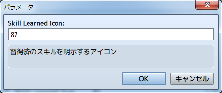

[目次に戻る](#目次)

## ウィンドウの表示設定

### アクターステータスウィンドウの表示設定

アクターステータスウィンドウには、デフォルトで以下のパラメータを表示します。
* アクターの顔画像
* 名前
* レベル
* SP値

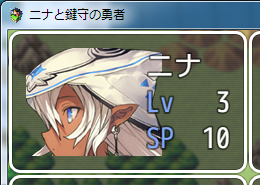

拡張プラグインのFTKR_CustomSimpleActorStatus.jsがある場合、
プラグインパラメータ`<ステータスの表示設定/Actor Status Layout>`以下の
設定に従い、表示内容を変更することができます。

各パラメータの意味と、設定方法は、
FTKR_CustomSimpleActorStatus.jsのヘルプを参照してください。

なお、歩行キャラ、SV戦闘キャラ、カスタムパラメータ、カスタムゲージの
設定は、FTKR_CustomSimpleActorStatus.jsの設定に従います。


### スキル説明ウィンドウの表示設定

以下のプラグインパラメータで、表示内容を変更します。

`<Skill Status Title Format>`

デフォルトで "[スキル名]のスキル情報" と表示しいる部分の設定です。
%1 を記述した箇所がアクター名に、%2 がスキル名に換わります。
制御文字が使えます。

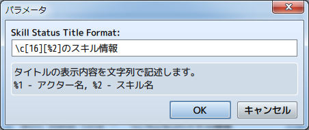

### 習得コストウィンドウの表示設定

以下のプラグインパラメータで、表示内容を変更します。

`<Cost Title Format>`

デフォルトで "習得コスト" と表示しいる部分の設定です。
制御文字が使えます。


`<Cost Item Format>`

デフォルトで、アイコンの後の "SP" 等と表示している部分の設定です。
%1 を記述した箇所が コスト名 に換わります。
制御文字が使えます。

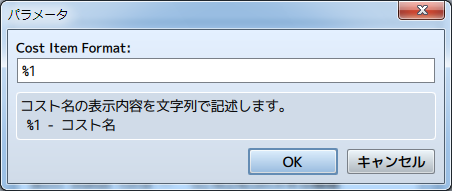

`<Cost Number Format>`

コストの数値を表示している部分の設定です。
'色番号, 文字列'の形式で記述します。
一つ目の数値がコスト数値の色を表します。
文字列に記述した %1 が コスト値、%2 が 手持ちの値に換わります。
文字列には制御文字は使用できません。

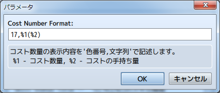

### 前提スキルウィンドウの表示設定

以下のプラグインパラメータで、表示内容を変更します。

`<Preskill Title Format>`

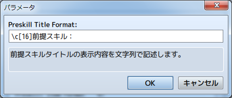

デフォルトで "前提スキル" と表示しいる部分の設定です。
制御文字が使えます。

`<Preskill Item Format>`

デフォルトで、前提スキル名を表示している部分の設定です。
%1 を記述した箇所が スキル名 に換わります。
制御文字が使えます。

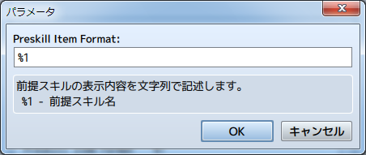

### 確認ウィンドウの表示設定

以下のプラグインパラメータで、表示内容を変更します。

`<Conf Title Format>`

デフォルトで "スキル習得の確認" と表示しいる部分の設定です。
%1 を記述した箇所がアクター名に、%2 がスキル名に換わります。
制御文字が使えます。

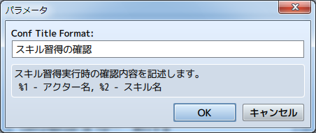

`<Confirmation Ok Format>`

デフォルトで、"実行する" を表示している部分の設定です。
制御文字は使えません。

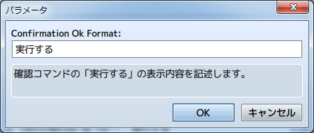

`<Confirmation Cancel Format>`

デフォルトで、"実行しない" を表示している部分の設定です。
制御文字は使えません。

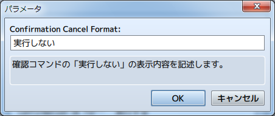

## その他の機能

### 制御文字の追加

本プラグインを実装することで、以下の制御文字を追加します。

`\LW[表示幅(,文章,表示位置)]`

#### 表示幅
文章を表示させる幅を、pixel単位で指定します。
文章を標準のサイズで表示するために必要な幅よりも小さい値の場合は、
文章を横に圧縮して表示します。

#### 文章
表示する文章を入力します。
制御文字は使用できません。
文章を入力しない場合、空欄をあける制御文字として使用できます。

#### 表示位置
表示幅内で文章をどの位置に表示するか指定します。
指定しない場合は、左寄せで表示します。
* right - 右寄せ
* center - 中央揃え

入力例)
```
◆文章：なし,ウィンドウ,下
：   ：\LW[200,こんにちは]いい天気ですね。
◆
```
上記のイベントの場合、メッセージ表示は「こんにちは　　　いい天気ですね。」となります。

[目次に戻る](#目次)

## スクリプトコマンド

以下のスクリプトコマンドが使用できます。
eval値に使用する場合は、'$gameActors.actor(x)'を'a'に置き換えてください。

### 現在SPの取得

`$gameActors.actor(x).stsSp()`

指定したアクターの、現在SPを値を取得します。
* x - アクターID

### スキル習得有無の取得

`$gameActors.actor(x).isStsLearnedSkill(y)`

指定したアクターが、指定したスキルを習得したことがあるかどうかを取得します。
* x - アクターID
* y - スキルID

`$gameActors.actor(x).canStsLearnedSkill(y)`

### スキル習得可否の判定

指定したアクターが、指定したスキルを習得できるかどうかを判定します。
* x - アクターID
* y - スキルID

### スキルを習得

`$gameActors.actor(x).stsLearnSkill(y)`

指定したアクターが、指定したスキルを習得します。
習得に必要なコストも同時に支払います。
スキルの複数回習得機能を有効にしている場合は、習得回数も増加します。
* x - アクターID
* y - スキルID

[目次に戻る](#目次)

## プラグインコマンド

### スキルツリー画面の表示
```
STS Open
STS スキルツリー画面表示
```

### SPの取得
```
STS ADD SP(x) ACTOR(y)
STS 加算 SP(x) アクター(y)
```
指定したアクターが、SPを取得します。
* x - 取得SP値
* y - アクターID


### スキルの取得回数の取得
```
STS GET VARCOUNT(x) ACTOR(y) SKILL(Z)
STS 習得回数取得 変数(x) アクター(y) スキル(z)
```
指定したアクターがスキルを習得している回数を
ゲーム内変数に格納します。
* x - 変数ID
* y - アクターID
* z - スキルID


### ツリーのリセット
```
STS RESET ACTOR(x) ALL
STS リセット アクター(x) すべて

STS RESET ACTOR(x) TREETYPE(y)
STS リセット アクター(x) ツリータイプ(y)
```
指定したアクターのスキルツリーを、すべてまたは指定した対象のみ
リセットします。
リセットしたツリーに使用したSPはアクターに戻ります。
* x - アクターID
* y - ツリータイプID


### ツリーの初期化
```
STS CLEAR ACTOR(x) ALL
STS 初期化 アクター(x) すべて

STS CLEAR ACTOR(x) TREETYPE(y)
STS 初期化 アクター(x) ツリータイプ(y)
```
指定したアクターのスキルツリーを、すべてまたは指定したツリーのみ
初期化します。
初期化したツリーに使用したSPはアクターに戻りません。
* x - アクターID
* y - ツリータイプID

### スキルを習得
```
STS LEARN ACTOR(x) SKILL(y)
STS スキル習得 アクター(x) スキル(y)
```
指定したアクターが、指定したスキルを習得します。
習得に必要なコストも同時に支払います。
ただし、指定したスキルを習得する条件(前提スキル、コスト、習得条件)を満たしていない場合は習得できません。
* x - アクターID
* y - スキルID

### スキルツリーを追加する
```
STS ADD TREETYPE(x) ACTOR(y)
STS 追加 ツリータイプ(x) アクター(x)
```
指定したアクターに、指定したスキルツリーを追加します。
* x - ツリータイプID
* y - アクターID


### スキルツリーを削除する
```
STS REDUCE TREETYPE(x) ACTOR(y)
STS 削除 ツリータイプ(x) アクター(x)
```
指定したアクターの、指定したスキルツリーを削除します。
ただし、初めから適用しているツリータイプ(アクターとクラスのタグで
設定したもの)は削除できません。
* x - ツリータイプID
* y - アクターID

[目次に戻る](#目次)

## プラグインの更新履歴

| バージョン | 公開日 | 更新内容 |
| --- | --- | --- |
| [ver1.6.3](FTKR_SkillTreeSystem.js) | 2017/04/07 | ヘルププラグインと統合 |
| ver1.6.2 | 2017/04/02 | プラグイン内ヘルプ参照、[ツクマテ](http://tm.lucky-duet.com/viewtopic.php?f=5&t=3201)で公開 |
| ver1.0.0 | 2017/02/25 | 初版作成、[ツクマテ](http://tm.lucky-duet.com/viewtopic.php?f=5&t=3201)で公開 |

## 拡張プラグイン

以下のプラグインを使用することで、本プラグインの機能を拡張できます。

* [FTKR_STS_CustomWindow.js](FTKR_STS_CustomWindow.js) - レイアウト変更
* [FTKR_CustomSimpleActorStatus.js](FTKR_CustomSimpleActorStatus.js) - アクターのステータス表示変更
* [FTKR_DisplayCommandFrame.js](FTKR_DisplayCommandFrame.js) - スキル枠の表示変更

## ライセンス

本プラグインはMITライセンスのもとで公開しています。

[The MIT License (MIT)](https://opensource.org/licenses/mit-license.php)

#
[目次に戻る](#目次)

[トップページに戻る](README.ja.md)